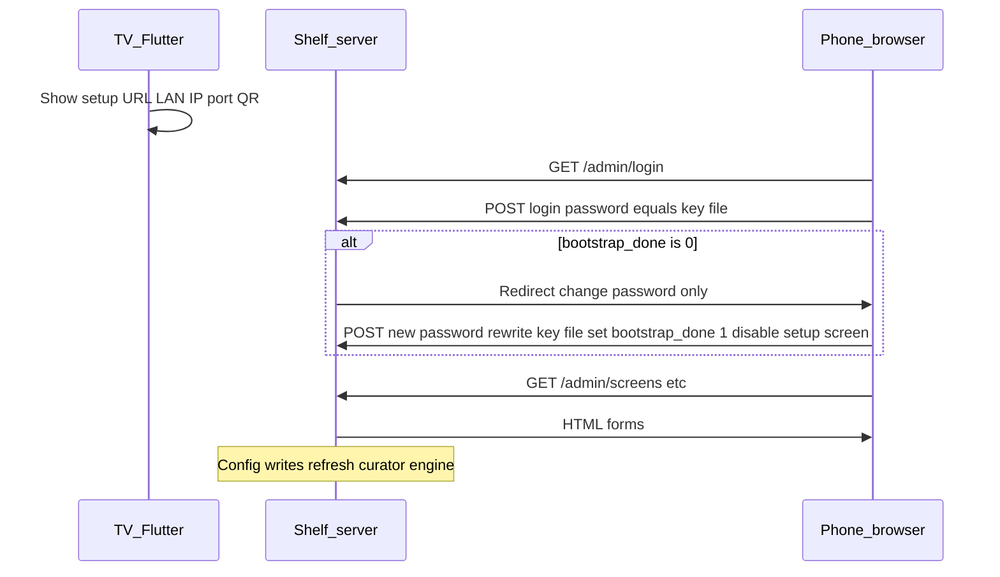

# Admin web UI, setup flow, and first-login password rotation

## Current baseline (what you have today)

- **[`lib/api/local_rest_server.dart`](apps/waddle_view/lib/api/local_rest_server.dart)**: Shelf server, `X-Api-Key` / Bearer auth via [`FileDeploymentApiKeySource`](apps/waddle_view/lib/api/deployment_api_key_source.dart), JSON routes under `/v1/*`, health unauthenticated.
- **[`lib/main.dart`](apps/waddle_view/lib/main.dart)**: On first launch, creates [`waddle_api.key`](apps/waddle_view/lib/main.dart) with 32 random bytes as hex (already a strong install-time secret). Server binds to **`127.0.0.1`** only—**a phone on Wi‑Fi cannot open the admin URL** until binding is widened (see Networking).
- **Data model**: Screens [`ScreenDefinitions`](apps/waddle_view/lib/persistence/tables.dart), curator [`CuratorSettings`](apps/waddle_view/lib/persistence/tables.dart) + [`DashboardKv`](apps/waddle_view/lib/persistence/tables.dart), providers [`ProviderSettings`](apps/waddle_view/lib/persistence/tables.dart), provider tokens via [`SecretStore`](apps/waddle_view/lib/secrets/secret_store.dart) keys like `provider:access_token:<id>` ([`ProviderConfigResolver.accessTokenKey`](apps/waddle_view/lib/config/provider_config_resolver.dart)).
- **TV hint**: [`LocalApiSlideWidget`](apps/waddle_view/lib/dashboard/local_api_slide_widget.dart) shows loopback URL and text about the key file—no QR, no LAN URL.

## Product decisions (this plan’s defaults)

1. **Single rotating secret for MVP**: The install-time value in `waddle_api.key` is both the **REST `X-Api-Key`** and the **admin login password** until the user changes it. Changing it **rewrites the key file** (automation must be updated). This matches “random password at install” and “change password after login” without storing plaintext passwords in SQLite. *(If you later want a separate human password and a fixed automation key, that becomes a second credential and more moving parts.)*

2. **Admin UI delivery**: **Server-rendered HTML** from Shelf under `/admin/...` (forms + redirects). Same origin as `/v1/*`, cookie session for the browser, no SPA build pipeline. Keeps dependencies small and fits existing `shelf` / `shelf_router` usage.

3. **First-time forced rotation**: Only when **`waddle_api.key` is created on that run** (new install), insert [`DashboardKv`](apps/waddle_view/lib/persistence/tables.dart) `admin.bootstrap_done` = `0`. After successful **change-password**, set to `1`. **Upgrades** where the key file already existed: if `admin.bootstrap_done` is **absent**, treat as **done** so existing deployments are not forced to rotate.

4. **Setup screen lifecycle**: The dedicated setup slide is **only for the initial onboarding window**. When setup is complete (`admin.bootstrap_done` set to `1` after the forced password change), **disable that screen** in [`ScreenDefinitions`](apps/waddle_view/lib/persistence/tables.dart) (`enabled = false` for a fixed id, e.g. `admin_setup`) in the **same** commit as flipping the kv flag so it **drops out of the rotator** immediately. Users who need the URL again can use the admin UI or re-enable the screen manually if desired.

## Architecture (high level)

## Networking (required for QR / phone)

- **Today**: [`LocalRestServer.bind`](apps/waddle_view/lib/api/local_rest_server.dart) uses `InternetAddress.loopbackIPv4`.
- **Change**: Support a **configurable bind address** (environment variable documented next to existing [`WADDLE_API_KEY_FILE`](docs/pi/api.md) patterns), e.g. `WADDLE_HTTP_BIND=0.0.0.0` for Pi LAN access, defaulting to loopback for dev safety.
- **Display URL**: Helper (new small module under `lib/api/` or `lib/net/`) to pick a **non-loopback IPv4** from `NetworkInterface` for the setup slide and QR; fall back to `127.0.0.1` when none (dev).
- **Docs**: Extend [`docs/pi/api.md`](docs/pi/api.md) (and [`README.md`](apps/waddle_view/README.md) if needed): firewall the port, prefer reverse proxy + TLS on untrusted networks—same guidance already hinted at in docs.

## Shelf: routing and auth layers

Extend [`buildRootHandler`](apps/waddle_view/lib/api/local_rest_server.dart) (or split into a dedicated `admin_server.dart` imported from there):

| Layer | Path | Auth |
|--------|------|------|
| Health | `/v1/health` | None |
| JSON API | `/v1/*` | Existing API key middleware |
| Admin static/forms | `/admin/*` | Session cookie (see below) |
| Admin login | `/admin/login` | Public POST |
| Optional | `/admin/bootstrap` | Public GET redirect to `/admin/login` if you want a short URL in QR |

**Session design (minimal)**:

- On successful login, compare password with `constantTimeStringEquals` to current key from [`DeploymentApiKeySource`](apps/waddle_view/lib/api/deployment_api_key_source.dart) (reuse [`api_key_constant_time.dart`](apps/waddle_view/lib/api/api_key_constant_time.dart)).
- Issue an **opaque random session id** stored in an in-memory map (sufficient for single-user Pi); **HttpOnly** cookie; optional **SameSite=Lax**.
- Middleware: valid session → allow admin HTML and admin JSON (if any); else redirect to `/admin/login`.
- **Force password change**: If `admin.bootstrap_done == '0'`, allow only `/admin/login`, `/admin/logout`, `/admin/change-password` (and POST handlers).

**CSRF**: Include a per-session or per-form random token in HTML forms; validate on POST for all mutating admin routes.

**Password change**: POST new password (with confirmation); validate strength minimally (length); **rewrite `waddle_api.key`** atomically; update `admin.bootstrap_done` to `1`; **set the setup screen row `enabled = false`** (by stable screen id); then **`await` curator refresh** so the TV program updates immediately; invalidate other sessions.

## Applying config changes to the running app

Admin writes will update Drift tables and `SecretStore`. The dashboard currently loads curation from DB via [`ScreenRotator`](apps/waddle_view/lib/dashboard/screen_rotator.dart) / curator; after edits, call **`dashboardCurator.refresh()`** (the gated instance from [`main.dart`](apps/waddle_view/lib/main.dart)).

- **Composition change**: Pass a small callback or [`DashboardCurator`](apps/waddle_view/lib/curator/dashboard_curator.dart) port into the Shelf root handler factory so admin POST handlers can `await refresh()` after successful commits (same pattern as `DataCollectionEngine` already using `onCycleComplete: dashboardCurator.refresh`).

## TV setup screen (Flutter)

- **New slide type** (e.g. `admin_setup`) in layout JSON and [`screen_rotator.dart`](apps/waddle_view/lib/dashboard/screen_rotator.dart) switch, **or** extend **`local_api`** widget with optional config flags—prefer a dedicated widget to avoid overloading developer slide semantics.
- **Content**: Short required-setup copy, **LAN admin base URL** (`http://<lan-ip>:<port>`), **QR** via existing [`qr_flutter`](apps/waddle_view/pubspec.yaml) encoding `http://<lan-ip>:<port>/admin/login` (or `/admin` redirect).
- **Bootstrap secret display**: Only while setup is incomplete (`admin.bootstrap_done == '0'`): show the current key with a clear warning (and optionally “tap to reveal” if the Pi has touch). **After setup completes, this screen is disabled**—it is not shown with “post-setup” content; reopening setup is via admin (or manually re-enabling the screen row).
- **Seed**: Add an idempotent row in [`initial_seed.dart`](apps/waddle_view/lib/seed/initial_seed.dart) for this screen with **`enabled = true`** for new databases so first boot shows it; the **change-password handler** turns **`enabled = false`** when bootstrap finishes. For **upgraded** installs (bootstrap already “done”), seed should **not** force-enable this screen if you add the row in a migration—default **`enabled = false`** when inserting for legacy DBs, or only insert the row when `admin.bootstrap_done == '0'`.

## Admin UI pages (incremental but end-state aligned)

Implement in phases inside one router; each page is a GET form + POST handler.

1. **Dashboard / status**: Link to sections; show bind URL reminder.
2. **Screens**: List [`screen_definitions`](apps/waddle_view/lib/persistence/tables.dart); edit dwell, weights, enabled, name/description; **layout JSON** as textarea with server-side validation via existing [`screen_layout_parse.dart`](apps/waddle_view/lib/curator/screen_layout_parse.dart) where applicable.
3. **Curator**: Edit [`CuratorSettings`](apps/waddle_view/lib/persistence/tables.dart) (`programDurationMs`, `historyDepth`) and selected [`DashboardKv`](apps/waddle_view/lib/persistence/tables.dart) keys (e.g. `curator.ticker.newsPixelsPerSecond`, guest Wi‑Fi key already used elsewhere).
4. **Providers**: CRUD [`ProviderSettings`](apps/waddle_view/lib/persistence/tables.dart) (non-secret fields); **access token** fields write **`SecretStore`** only (`provider:access_token:<id>`), never echo full value back (mask as `••••` if present).
5. **RSS** (optional same milestone or follow-up): Manage [`RssFeedSources`](apps/waddle_view/lib/persistence/tables.dart) if product wants it under “providers.”

REST `/v1/*` can gain matching **write** endpoints later for automation parity; not required for the browser MVP if all writes go through admin forms first.

## Testing and coverage

- **Shelf tests** (mirror [`test/local_rest_server_test.dart`](apps/waddle_view/test/local_rest_server_test.dart)): login, session cookie, forced redirect to change-password when `bootstrap_done` is `0`, CSRF rejection, password rotation updates file and flips kv flag, **setup `screen_definitions` row ends with `enabled == false`**, admin route blocked without session.
- **Unit tests**: LAN URL helper (fake interfaces or injectable abstraction).
- **Widget tests**: New setup slide renders URL + QR for a fixed fake LAN IP.
- Run **`flutter test --coverage`** and **`dart run tool/coverage_check.dart --min=90`** per [`AGENTS.md`](AGENTS.md).

## Documentation

- Update [`docs/pi/api.md`](docs/pi/api.md): admin paths, session auth, bind env var, QR flow, that rotating admin password rotates the API key.
- Short note in [`apps/waddle_view/README.md`](apps/waddle_view/README.md) pointing to Pi doc.

## Risk notes

- **LAN exposure**: Binding to `0.0.0.0` exposes **both** JSON API and admin UI to the LAN; reliance on the shared secret + firewall is critical—document prominently.
- **HTTP**: QR will be `http://` unless you add TLS termination; acceptable for many home LANs if documented.
