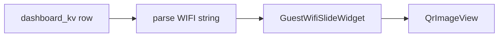

# Guest WiFi QR screen definition

## Configuration source

There is no Wi‑Fi field in the codebase today. Configuration will follow existing patterns: **[`DashboardKv`](apps/waddle_view/lib/persistence/tables.dart)** key/value rows (same store as `header.title`, `ticker.marquee.*`, `curator.ticker.newsPixelsPerSecond`).

- **Stored value**: The exact string encoded in the QR image — the standard **Wi‑Fi connection URI** (often called a “Wi‑Fi URL”), not HTTP. Format is the de‑facto `WIFI:` scheme, e.g. `WIFI:T:WPA;S:MyGuest;P:secret;H:false;;` (Android/guest QR scanners expect this).
- **Proposed key** (overridable in widget config): `dashboard.guest_wifi.connection` — holds that full `WIFI:...` string. Operators set it via whatever path they use today for KV (direct SQLite, future admin UI, or a later REST route — **out of scope** unless you want it in this change).

**Security note:** The PSK will live in SQLite like other dashboard text. That matches a lobby display showing the password; it is not a `SecretStore` credential (those are for API keys per [AGENTS.md](AGENTS.md)).

## Implementation

1. **Parsing helper** (new small module, e.g. [`apps/waddle_view/lib/dashboard/wifi_connection_uri.dart`](apps/waddle_view/lib/dashboard/wifi_connection_uri.dart) or under `lib/util/`):
   - Input: full `WIFI:...` string.
   - Output: structured fields for display and QR: **raw string for QR** (same as stored), **SSID** (`S`), **security type** (`T` — e.g. WPA, WPA2, WPA3, nopass), **password** (`P`, nullable for open networks), optional **hidden** (`H`).
   - Implement a practical parser for semicolon‑delimited `KEY:VALUE;` segments; handle common escaping (`\;`, `\,`, `\\` per common QR Wi‑Fi specs). Return a clear “invalid / empty” result for bad input so the UI can show a short message instead of crashing.

2. **Widget** (new file, e.g. [`guest_wifi_slide_widget.dart`](apps/waddle_view/lib/dashboard/guest_wifi_slide_widget.dart)):
   - Mirrors [`joke_slide_widget.dart`](apps/waddle_view/lib/dashboard/joke_slide_widget.dart): takes `AppDatabase`, `ThemeData`, and `ParsedWidgetSpec`.
   - **`StreamBuilder`** on the KV row for `config['kvKey'] ?? 'dashboard.guest_wifi.connection'` using Drift `watchSingleOrNull()` (same DB subscription pattern as [`main.dart`](apps/waddle_view/lib/main.dart) marquee watching all KV, but scoped to one key for efficiency).
   - Layout: optional Wi‑Fi graphic (`Icons.wifi`, large, themed), **headline** from `config['headline'] ?? 'Guest WiFi'`, **QrImageView** (reuse [`qr_flutter`](apps/waddle_view/lib/alerts/alert_overlay_host.dart) like alerts — white background, bounded size for TV), then labeled rows for SSID, security type, and password (masking **not** requested — plain text for guests).
   - Empty/missing KV or invalid payload: centered helper text (“Guest Wi‑Fi not configured”) — no fake credentials in seed.

3. **Screen rotator** — extend [`_SlideContent._buildWidgets`](apps/waddle_view/lib/dashboard/screen_rotator.dart) `switch` with a `guest_wifi` case delegating to the new widget.

4. **Seed** — in [`initial_seed.dart`](apps/waddle_view/lib/seed/initial_seed.dart), add `_ensureGuestWifiScreen` (same idempotent pattern as `_ensureJokeScreen`): insert screen id `guest_wifi` (or `guest-wifi`) with `layoutJson` containing one widget `{"type":"guest_wifi","slot":"main","config":{}}` and a sensible `dwellMs` (e.g. 15–20s). **Do not** insert a real password into KV by default.

## Tests (tests first for new behavior)

- **Unit tests** for the parser: valid WPA string, `nopass`, empty/malformed, escaped characters if implemented.
- **Widget test**: in-memory Drift DB, insert KV + pump `GuestWifiSlideWidget` (or the smallest wrapper that supplies theme/db), find headline and QR/substrings as appropriate.

Run `flutter analyze`, `flutter test --coverage`, and `dart run tool/coverage_check.dart --min=90` from [`apps/waddle_view`](apps/waddle_view).

## Optional follow-ups (not in minimal scope)

- Document `dashboard.guest_wifi.connection` in [`ARCHITECTURE.md`](apps/waddle_view/ARCHITECTURE.md) next to other KV examples.
- Add `GET/PATCH /v1/dashboard/kv` (or single key) on [`local_rest_server.dart`](apps/waddle_view/lib/api/local_rest_server.dart) for remote configuration.
