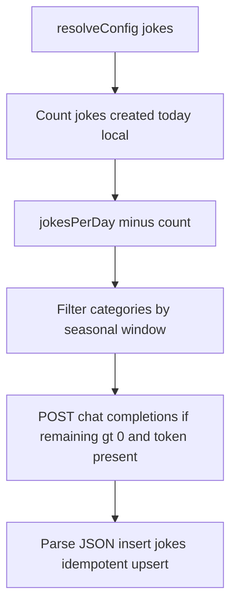

# Joke data provider

## Context

- Providers implement [`IDataProvider`](apps/waddle_view/lib/data/data_provider.dart) (`id`, `collect(DataWriteContext)`). The engine runs them sequentially; **`collect` must be idempotent-safe per tick** like RSS ([`RssNewsDataProvider`](apps/waddle_view/lib/data/providers/rss_news_data_provider.dart)).
- Runtime knobs merge SQLite **`provider_settings`** + **`SecretStore`** via [`ProviderConfigResolver`](apps/waddle_view/lib/config/provider_config_resolver.dart) → [`ProviderRuntimeConfig`](apps/waddle_view/lib/config/provider_runtime_config.dart) (`baseUrl`, `extraJson`, **`accessToken`** from key `provider:access_token:<providerId>`). **Do not put API keys in SQLite** ([AGENTS.md](AGENTS.md)).
- There is **no OpenAI client** in the repo today; use **`package:http`** only (already in [`pubspec.yaml`](apps/waddle_view/pubspec.yaml)), mirroring RSS tests’ [`http.BaseClient`](apps/waddle_view/test/data/rss_news_data_provider_test.dart) for deterministic tests.

## Data model (Drift)

Add two tables in [`tables.dart`](apps/waddle_view/lib/persistence/tables.dart) and register them in [`database.dart`](apps/waddle_view/lib/persistence/database.dart) with **`schemaVersion` → 7** and `onUpgrade` creating the new tables:

1. **`JokeCategories`**
   - `id` (text PK) — stable slug, e.g. `dad`, `christmas`.
   - `label` (text) — display name.
   - `isSeasonal` (bool, default false).
   - For seasonal rows only: **annual window** using four integers — `startMonth`, `startDay`, `endMonth`, `endDay` (1-based months/days). Nullable when `isSeasonal` is false.
   - `categoryPrompt` (text, nullable) — extra instructions when generating jokes for this category.
   - Eligibility helper (pure Dart, unit-tested): “today” in **local** `DateTime` must fall in `[start..end]` **with year-boundary wrap** (e.g. Dec 15 → Jan 7 counts as one window).

2. **`Jokes`**
   - `id` (text PK) — hash of stable fields (e.g. `categoryId + '\x00' + setup + '\x00' + punchline`) like [`rssArticleId`](apps/waddle_view/lib/data/providers/rss_news_data_provider.dart).
   - `categoryId` → references `JokeCategories`.
   - `setup` (text), `punchline` (text).
   - `createdAtMs` (int).

Index `jokes` on `createdAtMs` (and optionally `categoryId`) to make **daily counts** cheap.

**Daily quota:** Instead of a separate counter table, compute “jokes added today” with a query on `createdAtMs` between **local** start/end of day (same approach as daily caps elsewhere—simple and consistent with inserted rows).

## Provider configuration (`provider_settings` row `id = 'jokes'`)

Parse JSON from `ProviderRuntimeConfig.extraJson` (new small type, e.g. `JokeProviderExtraConfig`, in `lib/data/providers/`):

- **`jokesPerDay`** (int, required default e.g. `3` if missing).
- **`model`** (string, default e.g. `gpt-4o-mini`).
- **`systemPrompt`** or **`globalPrompt`** (string) — overall instructions for the model.
- Optional: **`maxOutputTokens`**, **`temperature`** — keep minimal unless tests need them.

Use **`baseUrl`** from the row (via `ProviderRuntimeConfig`) as the OpenAI API root, defaulting to `https://api.openai.com/v1` when null in seed/tests.

**Auth:** `Authorization: Bearer ${accessToken}` from resolved config (user stores key via existing secret mechanism).

## `JokeDataProvider.collect` behavior

1. Resolve config; if **`accessToken` missing**, log via [`AppDebugLog`](apps/waddle_view/lib/debug/app_debug_log.dart) and **return** (no network).
2. Enforce **daily cap**: if today’s count ≥ `jokesPerDay`, return.
3. Build **eligible categories**: non-seasonal always; seasonal only if today falls in their annual window.
4. If `remaining > 0` and eligible categories non-empty, **one HTTP call** requesting a **JSON array** of `remaining` jokes (structured output in the user message: require strict JSON, no markdown). Each item includes `categoryId`, `setup`, `punchline`. **Pick categories** for the batch by round-robin or random shuffle over eligible IDs so seasonal slots are used when in season.
5. Compose prompts: **system** = global prompt from `extraJson`; **user** = list of category ids + each category’s `categoryPrompt` where non-null + schema instructions.
6. **Upsert** rows; ignore duplicates by primary key.

## Wiring and seed

- Register `JokeDataProvider()` in [`main.dart`](apps/waddle_view/lib/main.dart) alongside existing providers.
- In [`initial_seed.dart`](apps/waddle_view/lib/seed/initial_seed.dart): `_ensureProviderRow` for `id: 'jokes'`, `providerType: 'jokes'`, sensible `pollSeconds` (e.g. `3600` — frequent enough to fill quota; daily logic still gates generation).
- New seed module (e.g. [`lib/seed/joke_category_seed.dart`](apps/waddle_view/lib/seed/joke_category_seed.dart)): idempotent inserts for categories: **dad, mom, animal, school, work** (non-seasonal); **christmas, easter, halloween, thanksgiving** (seasonal with documented default MM-DD windows — adjustable later in DB). Include short **`categoryPrompt`** examples where helpful.

Run **`dart run build_runner build`** after Drift table edits (project norm).

## Tests (TDD per AGENTS.md)

Add under `test/data/` (and helpers if needed):

- **Seasonal eligibility** — table-driven: non-seasonal always true; same-year window; wrap window (e.g. Dec 20–Jan 5).
- **`JokeDataProvider`** — memory DB + fake HTTP returning a fixed Chat Completions JSON body; inject **`DateTime`/`now` factory** and **`http.Client`** like RSS; assert rows inserted, daily cap (second collect same day no-ops), seasonal category excluded when “today” is out of window.
- Keep **`flutter analyze`**, **`flutter test --coverage`**, and **`dart run tool/coverage_check.dart --min=90`** green.

## Out of scope (unless you want them next)

- UI/ticker/dashboard surfaces for jokes (only persistence + collection here).
- Admin REST routes dedicated to jokes (optional follow-up; [`local_rest_server.dart`](apps/waddle_view/lib/api/local_rest_server.dart) already lists `provider_settings`).
