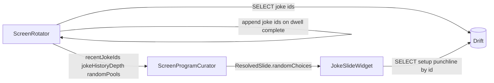

# Joke screen with curator-driven selection and count

## Requirement shift (from earlier draft)

- **[`ScreenProgramCurator`](apps/waddle_view/lib/curator/screen_program_curator.dart)** chooses **which** joke(s) appear and **how many** joke slides to insert when the joke screen candidate wins a weighted pick. The UI does **not** pick a random joke at render time.
- **[`ScreenRotator`](apps/waddle_view/lib/dashboard/screen_rotator.dart)** stays responsible for **loading data from Drift** before each program build: build `Map<String, List<String>>` pools of **joke row IDs** (mirroring how it loads blob keys into `randomPools` today), then pass that map into `buildProgram`.

## Screen configuration (layout JSON)

Document and implement parsing from existing `layoutJson` on [`screen_definitions`](apps/waddle_view/lib/persistence/tables.dart):

1. **`jokesPerProgram`** (integer, default **1**) — placed at the **root** of the decoded layout object next to `widgets` (same level as `v`, `layout`). When this screen wins the weighted pick, the curator emits **up to** this many consecutive [`ResolvedSlide`](apps/waddle_view/lib/curator/screen_program_curator.dart)s for that same `screenId`, each consuming `dwellMs` (clamped by remaining program time like today).

2. **Joke widget spec** — `{"type":"joke","slot":"main","config":{...}}` where `config` supports:
   - **`pool`** (string, optional) — names a key in the pools map (default e.g. `"jokes"` for all IDs). Allows future **`jokes_dad`**-style pools built in `ScreenRotator` from `categoryId` filters if you add those queries.
   - Optional **`categoryId`** — if you prefer a single global `jokes` pool, the rotator can register `pool` keys per category; alternatively one pool `"jokes"` and filter in rotator only. Pick one approach in implementation and keep the curator agnostic: it only consumes **lists of string IDs** per pool name.

**Duplicate avoidance in one program**: Reuse the same idea as `photo_random`: a `Set<String> usedJokeIds` (or shared with `usedRandomAssets` under a clear name) so the same joke ID is not placed twice in one program when enough distinct jokes exist.

**Avoid recently shown jokes (cross-program)**: The curator should prefer IDs that are **not** in a **rolling history of joke IDs** from recent screen programs, up to a **configurable depth** (same idea as [`historyDepth`](apps/waddle_view/lib/persistence/tables.dart) for screen ids, but for joke content).

- **Settings**: Add **`jokeHistoryDepth`** to [`CuratorSettings`](apps/waddle_view/lib/persistence/tables.dart) (integer, default e.g. **20**; `0` = do not use history filtering). Schema version bump + `onUpgrade` in [`database.dart`](apps/waddle_view/lib/persistence/database.dart), and default row in [`initial_seed.dart`](apps/waddle_view/lib/seed/initial_seed.dart) for new installs.
- **State**: [`ScreenRotator`](apps/waddle_view/lib/dashboard/screen_rotator.dart) keeps **`_recentJokeIdsOldestFirst`** (list, same style as `_recentScreenIds`), capped to a reasonable max size (e.g. 200–500) to bound memory; only the last **`jokeHistoryDepth`** entries influence selection.
- **When to record**: On each completed joke slide (when dwell elapses and the rotator would already append `slide.screenId` to screen history), append every **joke id** present in that slide’s `randomChoices` for `joke` widget keys (parse layout to know which choice keys are jokes, or append all `randomChoices` values that look like joke ids if multiple joke widgets exist). Deduplicate consecutive duplicate appends for the same id in one slide if ever needed.
- **Curator input**: Extend `buildProgram` with `recentJokeIdsOldestFirst: List<String>` and `jokeHistoryDepth: int`. When picking a joke id, first try **`available = poolIds.where((id) => !historyWindow.contains(id))`** where `historyWindow` is the last `jokeHistoryDepth` ids (same window helper pattern as [`_historyWindow`](apps/waddle_view/lib/curator/screen_program_curator.dart)). If `available` is empty, **fall back** to the full pool (or to `poolIds` minus in-program `usedJokeIds` only) so a small catalog or aggressive depth never deadlocks the UI.
- **Tests**: Table-driven cases — only 2 jokes in pool, depth 5, long history → must fall back; enough jokes → selected id should not be in the recent window when possible.

**Short pool**: If `jokesPerProgram` is 3 but only 2 unused IDs remain (after in-program and history filters, with fallback), emit **2** slides (do not fail the program). If **zero** IDs exist for the requested pool, emit **no** joke slides for that pick (or one slide with empty choice — prefer **skip emitting** so dwell budget is not wasted on empty content; document in tests).

## Curator algorithm changes

Extend `ScreenProgramCurator.buildProgram` (and helpers):

- When `_weightedPick` returns a candidate whose layout includes a `joke` widget **and** `jokesPerProgram > 0`:
  - Loop `i` from `0` to `min(jokesPerProgram, sensible cap) - 1`, each iteration:
    - Resolve joke choice(s) for that slide via an extended `_resolveRandomWidgets` (or sibling `_resolveJokeWidgets`) that fills `randomChoices` for each `ParsedWidgetSpec` with `type == 'joke'` using `randomPools` and the used-id set.
    - Append one `ResolvedSlide` with that map; decrement `remaining` by `dwell` where `dwell = min(candidate.dwellMs, remaining)`.
    - Stop inner loop early if `remaining <= 0` or no more joke IDs available for non-repeating picks.
- When the candidate has **no** joke widget, behavior stays one slide as today.
- **Tests**: [`screen_program_curator_test.dart`](apps/waddle_view/test/screen_program_curator_test.dart) — fixed `Random` seed + fake pools to assert slide count, distinct joke IDs, **history-window exclusion**, fallback when excluded set is empty, and interaction with `programDurationMs`.

## ScreenRotator

Before `buildProgram`, query Drift for joke primary keys (scoped by pool/category as decided above) and populate `randomPools` (e.g. `jokes` → all IDs). Read **`jokeHistoryDepth`** from `curator_settings` and pass **`_recentJokeIdsOldestFirst`** into `buildProgram`. After each slide’s dwell, update joke history from the outgoing slide’s resolved joke ids. No random joke selection in the UI layer.

## Joke slide widget (UI only)

- **`AppDatabase` + `ResolvedSlide` + `ParsedWidgetSpec`** — read **`slide.randomChoices[w.choiceKey]`** as the joke **id**. If missing, show placeholder.
- **Load text**: `SELECT setup, punchline WHERE id = ?` (single row).
- **Reveal timing**: unchanged intent — `Timer` after **`dwellMs ~/ 2`** for punchline; cancel on `dispose`.
- **Tests**: widget tests use a `ResolvedSlide` with **pre-filled** `randomChoices` (curator already decided), memory DB with one row; `fake_async` for half-dwell.

## Seed

- Add a [`screen_definitions`](apps/waddle_view/lib/persistence/tables.dart) row in [`initial_seed.dart`](apps/waddle_view/lib/seed/initial_seed.dart) with layout JSON including root `jokesPerProgram` and a `joke` widget.

## Files (primary)

| Responsibility | File |
|----------------|------|
| Layout parsing for `jokesPerProgram` | [`screen_layout_parse.dart`](apps/waddle_view/lib/curator/screen_layout_parse.dart) or small helper used by curator |
| Pool-based joke resolution + history + multi-slide emission | [`screen_program_curator.dart`](apps/waddle_view/lib/curator/screen_program_curator.dart) |
| `jokeHistoryDepth` + migration | [`tables.dart`](apps/waddle_view/lib/persistence/tables.dart), [`database.dart`](apps/waddle_view/lib/persistence/database.dart) |
| Build joke ID pools from DB + maintain joke history | [`screen_rotator.dart`](apps/waddle_view/lib/dashboard/screen_rotator.dart) |
| Display + punchline timer | `apps/waddle_view/lib/dashboard/joke_slide_widget.dart` |
| Wire `db` + switch `joke` | [`screen_rotator.dart`](apps/waddle_view/lib/dashboard/screen_rotator.dart) `_buildWidgets` |
| Tests | [`screen_program_curator_test.dart`](apps/waddle_view/test/screen_program_curator_test.dart), new `joke_slide_widget_test.dart` |

## Diagram

