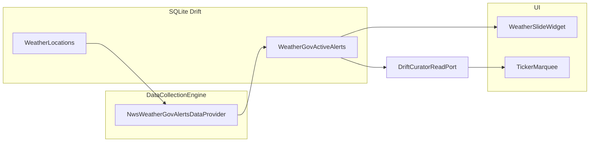

# NWS (api.weather.gov) active alerts integration

## Context (current code)

- Weather locations and OpenWeather snapshots live in `[WeatherLocations](apps/waddle-display/lib/persistence/tables.dart)` / `[WeatherCurrentData](apps/waddle-display/lib/persistence/tables.dart)`. The slide `[WeatherSlideWidget](apps/waddle-display/lib/display/screens/weather/weather_slide_widget.dart)` watches those tables by `locationId`.
- Collection: `[WeatherDataProvider](apps/waddle-display/lib/data/providers/weather/weather_data_provider.dart)` resolves the same enabled locations (or a JSON default) in `_resolveLocations`; `[DataCollectionEngine](apps/waddle-display/lib/data/engine/data_collection_engine.dart)` runs providers sequentially.
- Ticker: `[DefaultDashboardCurator](apps/waddle-display/lib/curator/default_dashboard_curator.dart)` calls `[buildTickerItemsForMarquee](apps/waddle-display/lib/curator/ticker_curation.dart)` with `[CurrentWeatherTickerData](apps/waddle-display/lib/curator/curator_read_port.dart)` from `[DriftCuratorReadPort.loadCurrentWeatherForTicker](apps/waddle-display/lib/curator/drift_curator_read_port.dart)`. Weather lines use `kind: 'weather'` so `[TickerMarquee](apps/waddle-display/lib/ticker/ticker_marquee.dart)` picks an icon from keywords in the body.

## API behavior (no API key)

- Endpoint: `GET {baseUrl}/alerts/active?point={lat},{lon}` (default `baseUrl`: `https://api.weather.gov`).
- Headers: `Accept: application/geo+json`; **User-Agent is required** — NWS documents a string like `(myweatherapp.com, contact@myweatherapp.com)` ([API overview](https://www.weather.gov/documentation/services-web-api)).
- Response: GeoJSON `FeatureCollection`; each feature’s `properties` includes fields such as `id`, `event`, `headline`, `description`, `severity`, `effective`, `expires` (parse defensively; many are strings).

## 1. Persistence (Drift)

- Add a new table, e.g. `**WeatherGovActiveAlerts`**, in `[tables.dart](apps/waddle-display/lib/persistence/tables.dart)`:
  - **Primary key**: composite `(locationId, nwsAlertId)` where `nwsAlertId` is `properties.id` (URN).
  - **Columns** (minimal but useful for UI/ticker): `locationId` (FK → `weather_locations`), `event`, `headline` (nullable), `severity` (nullable), `effectiveAt` / `expiresAt` (nullable `DateTimeColumn`), optional `instruction` or truncated `description` if you want richer slide text without huge rows.
  - **Index**: `locationId` for `watch()` queries on the slide.
- Register the table on `[AppDatabase](apps/waddle-display/lib/persistence/database.dart)`, bump `**schemaVersion` 24 → 25**, and in `onUpgrade` for `from < 25` call `m.createTable(weatherGovActiveAlerts)`.
- Run `dart run build_runner build` (or project’s Drift codegen command) to refresh `[database.g.dart](apps/waddle-display/lib/persistence/database.g.dart)`.

## 2. New data provider

- Add `**NwsWeatherGovAlertsDataProvider`** under e.g. `[lib/data/providers/nws_weather_gov/](apps/waddle-display/lib/data/providers/)` implementing `[IDataProvider](apps/waddle-display/lib/data/data_provider.dart)`:
  - `**id`**: e.g. `nws_weather_alerts` (stable string used in `provider_settings` and `main.dart`).
  - `**collect**`: If the matching `[ProviderSettings](apps/waddle-display/lib/persistence/tables.dart)` row is missing or `enabled` is false, return (same pattern as weather). Call `ctx.resolveConfig(id)` for `baseUrl` + `configJson` (no secret required; `accessToken` may be null).
  - **Location list**: Reuse the same rules as `[WeatherDataProvider._resolveLocations](apps/waddle-display/lib/data/providers/weather/weather_data_provider.dart)` — either extract a small shared helper (e.g. `resolveEnabledWeatherLocationsOrDefault`) used by both providers, or duplicate the short query + default-from-JSON logic to avoid a risky refactor. Default location shape in config can mirror the weather provider’s `defaultLocation` (`name`, `lat`, `lon`).
  - **HTTP**: Injected `http.Client`; set `User-Agent` from config (e.g. `userAgent` string) with a **safe default** that identifies the app and points operators to README for substituting real contact info (NWS guidance).
  - **Per location**: GET active alerts; on 200, **replace** rows for that `locationId` (transaction: delete all for location, then insert parsed features). On non-200 or parse errors, log via `AppDebugLog.provider` and leave prior rows or clear — pick one policy (recommend: **clear on hard failure** only if you want “no stale warnings”; otherwise **retain** last good snapshot to avoid flicker).
  - **Tests** (new file under `test/data/`): fake HTTP client returning a minimal GeoJSON body; assert rows written and replaced; assert skip when disabled / no provider row.

## 3. Registration and operator config

- Add `kProviderConfigJsonMeta['nws_weather_alerts']` in `[config_json_documentation.dart](apps/waddle-display/lib/persistence/config_json_documentation.dart)` (`userAgent`, optional `defaultLocation` with `lat`/`lon`/`name`).
- Seed an idempotent `**ProviderSettings`** row in `[provider_settings_seed.dart](apps/waddle-display/lib/seed/tables/provider_settings_seed.dart)` and the parallel block in `[initial_seed.dart](apps/waddle-display/lib/seed/initial_seed.dart)`: `providerType: 'nws_weather_alerts'`, `enabled: true`, sensible `pollSeconds` (e.g. 900 to align with weather), `baseUrl: https://api.weather.gov`, example `configJson` with placeholder `userAgent`.
- Register the provider in `[main.dart](apps/waddle-display/lib/main.dart)` `DataCollectionEngine.providers` (immediately after `WeatherDataProvider()` is a logical order).

## 4. Weather slide UI

- In `[weather_slide_widget.dart](apps/waddle-display/lib/display/screens/weather/weather_slide_widget.dart)`, after resolving `location`, add a `**StreamBuilder`** (or combine streams) on `db.select(db.weatherGovActiveAlerts)..where((t) => t.locationId.equals(location.id))`, ordered by severity / event.
- Render a compact list when non-empty (e.g. `Material` / `ListTile` / icon `Icons.warning_amber_rounded`, colored by `severity`), showing **event** + short **headline** (and optional expiry line). Keep layout consistent with existing spacing (`DashboardViewportScope.scaleOf`).
- Extend `[weather_slide_widget_test.dart](apps/waddle-display/test/display/weather_slide_widget_test.dart)` with rows in the new table and `expect(find.textContaining(...))` for alert text.

## 5. Ticker integration

- Introduce a small DTO (e.g. `WeatherGovAlertTickerItem { body; sourceId }`) in `[curator_read_port.dart](apps/waddle-display/lib/curator/curator_read_port.dart)`.
- Extend `[CuratorReadPort](apps/waddle-display/lib/curator/curator_read_port.dart)` with `Future<List<WeatherGovAlertTickerItem>> loadWeatherGovAlertsForTicker();`.
- Implement in `[DriftCuratorReadPort](apps/waddle-display/lib/curator/drift_curator_read_port.dart)`: join alerts with **enabled** `weather_locations`; build **one line per alert**, e.g. `{locationName}: {event} — {headline}` (trim/length cap ~120–160 chars); **dedupe** by `nwsAlertId` or redacted body for `_addTickerIfNew`.
- Thread into `[buildTickerItemsForMarquee](apps/waddle-display/lib/curator/ticker_curation.dart)`: new parameter `List<WeatherGovAlertTickerItem> weatherGovAlerts = const []`.
  - `**expandWeather()`** (definitions path): return `[weather line if any, ...alert lines]` each as `TickerItem(kind: 'weather', body: ..., sourceId: ...)`.
  - `**_buildTickerItemsForMarqueeLegacy`**: after the existing weather block, add the same alert items (before RSS/news) so behavior matches without ticker definitions.
- Update `[DefaultDashboardCurator.refresh](apps/waddle-display/lib/curator/default_dashboard_curator.dart)` to load alerts and pass them into `buildTickerItemsForMarquee`.
- Tests: extend `[ticker_curation_test.dart](apps/waddle-display/test/ticker_curation_test.dart)` — when `currentWeather` + `weatherGovAlerts` are set, expect multiple `kind == 'weather'` items with distinct bodies/sourceIds.

## 6. Documentation

- Update `[apps/waddle-display/README.md](apps/waddle-display/README.md)` (or operator-facing doc you already use): NWS provider id, that **User-Agent must identify the deployment**, link to NWS API docs, and that alerts are US-only (api.weather.gov scope).

## Data flow (high level)

## Risk / scope notes

- **US coverage only** — acceptable given api.weather.gov.
- **Rate limits**: one request per enabled location per engine cycle; document that many locations increase call volume.
- **No secrets** in SQLite; optional `userAgent` is not sensitive but should be configurable.

