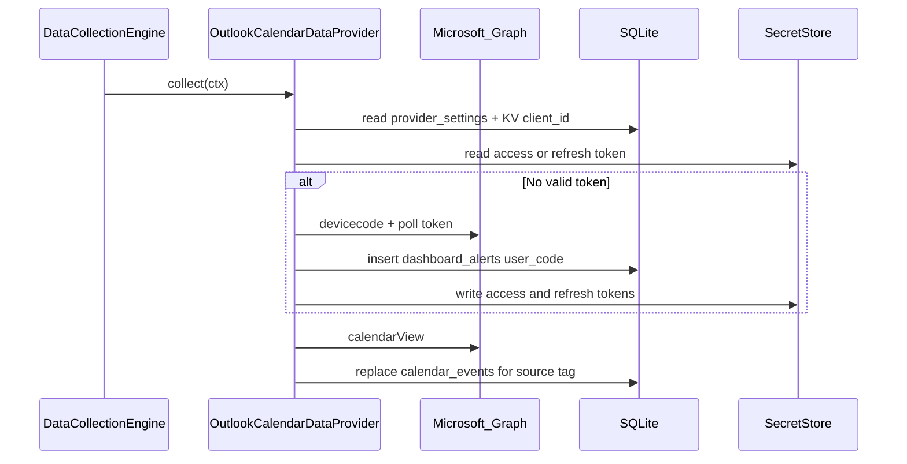

# Outlook calendar provider (Microsoft Graph)

## Architecture choices

- **Single provider row, multiple Microsoft accounts**: One [`IDataProvider`](apps/waddle_view/lib/data/data_provider.dart) instance with `id == 'outlook_calendar'`. [`provider_settings.extra_json`](apps/waddle_view/lib/persistence/tables.dart) holds an **`accounts`** array; each entry has a stable **`graphAccountKey`** (e.g. `personal`, `work`) used only for secrets and for tagging rows in SQLite.
- **Shared Graph app configuration**: Store the Azure app (client) id in **`config_key_values`** so future Graph-based providers reuse it. Suggested key constant in code (e.g. [`lib/config/microsoft_graph_kv.dart`](apps/waddle_view/lib/config/microsoft_graph_kv.dart)): `microsoft.graph.client_id`, default value **`27bc410e-75a4-4bdc-9281-921f446aef52`**, applied idempotently from [`ensureInitialSeed`](apps/waddle_view/lib/seed/initial_seed.dart) (same pattern as display theme KVs: insert only if missing).
- **Shared token secrets** (multiple providers / one account): Use account-scoped keys, not `provider:access_token:<providerRowId>`:
  - Access: `provider:access_token:microsoft_graph:<graphAccountKey>`
  - Refresh (required for stable operation; not contradicting “store access token”): `provider:refresh_token:microsoft_graph:<graphAccountKey>` — document in README next to access key.
- **Per-account mailboxes and calendars**: In each account object, e.g. **`sources`**: `[{ "mailbox": "user@domain.com", "calendars": ["Calendar", "Team"] }]` where **`mailbox`** is the Graph user UPN (or `me` if you later add a shortcut). **`calendars`**: list of display names **or** Graph calendar `id` strings; resolve names via `GET /users/{mailbox}/calendars` and match case-insensitively (exact plan in code comments). Empty **`accounts`** → `collect` returns early with a log line (no network).
- **Date window**: `pastDays` / `futureDays` in `extra_json` (defaults **14** / **14**) bound `calendarView` `startDateTime` / `endDateTime` in UTC ISO8601.
- **Poll cadence**: `pollSeconds` on the provider row default **3600**; gate with a KV like [`kPexelsLastCollectKvKey`](apps/waddle_view/lib/data/providers/pexels_data_provider.dart) (`provider.outlook_calendar.last_collect_ms`) so the global engine cycle does not hammer Graph every 30s.
- **SQLite `calendar_events`**: Set **`source`** to a stable tag such as `outlook_calendar:<graphAccountKey>` and **`externalId`** to the Graph event `id` (or `@odata.id` suffix). Before re-syncing an account, **delete** existing rows with that `source` and `startMs` inside the current sync window (or all rows for that `source` in the configured window) then insert the fresh set so removals in Outlook propagate.

## OAuth device code flow

- Implement small HTTP helpers (existing [`http`](apps/waddle_view/pubspec.yaml) only — **no new dependency**) in something like [`lib/data/providers/microsoft_graph/device_code_auth.dart`](apps/waddle_view/lib/data/providers/microsoft_graph/device_code_auth.dart):
  - `POST https://login.microsoftonline.com/common/oauth2/v2.0/devicecode` with `client_id`, `scope` including **`offline_access`**, **`Calendars.Read`**, **`User.Read`** (minimum for `/me` and delegated calendars).
  - Insert a **`dashboard_alerts`** row via `ctx.db` mirroring [`DriftAlertRepository.insertAlert`](apps/waddle_view/lib/alerts/drift_alert_repository.dart): **title** e.g. “Microsoft sign-in”, **body** includes **`user_code`**, `verification_uri`, and short instructions; **`expiresAt`** from `expires_in`; **`priority`** high enough to surface; **`source`** e.g. `outlook_calendar` (table default is `api` — override with `Value('outlook_calendar')` if the generated companion supports it).
  - Poll `.../token` with `grant_type=urn:ietf:params:oauth:grant-type:device_code` until success, timeout, or `authorization_pending`; dismiss or let the alert expire when done.
  - **Throttle** repeated device prompts: if there is already an active (non-dismissed, non-expired) alert with the same title/source for this account, or KV `provider.outlook_calendar.last_device_prompt_ms`, skip starting a new flow for a cooldown window (e.g. 10–15 minutes) to avoid spam when the TV is unattended.
- **Token refresh**: On each collect, for each account with configured sources, if access token missing or near expiry (track `expires_at` in KV `microsoft.graph.access_token_expires_at.<graphAccountKey>` or parse from token if you prefer JWT `exp` without adding `jwt_decoder` — KV is simpler), call `grant_type=refresh_token` and rewrite access + refresh secrets.

## Graph sync

- New [`OutlookCalendarDataProvider`](apps/waddle_view/lib/data/providers/outlook_calendar_data_provider.dart) (or split sync vs auth for coverage):
  - Read client id from `config_key_values`; skip with log if absent.
  - Parse `extra_json` with a dedicated parser class (pattern: [`PexelsProviderExtraConfig`](apps/waddle_view/lib/data/providers/pexels_provider_extra_config.dart)).
  - For each account: ensure valid access token → for each `mailbox` / resolved `calendarId`: `GET https://graph.microsoft.com/v1.0/users/{upn}/calendars/{id}/calendarView?...` (or single default calendar when `calendars` empty — document behavior).
  - Map Graph events → `CalendarEventsCompanion` (`allDay`, `location`, `bodyPreview`/`body` → `description` truncated if needed).
- **Register** provider in [`main.dart`](apps/waddle_view/lib/main.dart) next to other providers.

## Seeding and docs

- In [`ensureInitialSeed`](apps/waddle_view/lib/seed/initial_seed.dart): ensure KV `microsoft.graph.client_id`; add **`_ensureOutlookCalendarProviderRow`** with `providerType: 'outlook_calendar'`, `pollSeconds: 3600`, `enabled: false` (recommended) or `true` with empty accounts (no-op) — prefer **disabled by default** so operators enable after configuring `extra_json`.
- Update [`apps/waddle_view/README.md`](apps/waddle_view/README.md): client id location, `extra_json` schema, secret key names, required Azure app permissions (delegated), device-code UX on the dashboard, optional debug env vars for tokens (mirror [`dev_dotenv_secrets.dart`](apps/waddle_view/lib/config/dev_dotenv_secrets.dart) pattern if useful).
- Update [`.env.example`](apps/waddle_view/.env.example) only if you add dev env keys.

## Tests (TDD per AGENTS)

- Add [`test/data/outlook_calendar_data_provider_test.dart`](apps/waddle_view/test/data/outlook_calendar_data_provider_test.dart) with `openMemoryDatabase` + `InMemorySecretStore`, fake `http.Client` that serves devicecode → token → calendarView JSON; assert:
  - events written with expected `source` / `externalId`;
  - alert inserted containing `user_code` when starting device flow;
  - refresh path updates secrets without device flow when refresh token present;
  - poll gate skips second collect within `pollSeconds`;
  - empty `accounts` performs no HTTP.
- Run `flutter test --coverage` and `dart run tool/coverage_check.dart --min=90`.

## Optional follow-ups (out of scope unless you want them now)

- Extend admin “access token” save path to understand `graphAccountKey` (currently always [`provider:access_token:$id`](apps/waddle_view/lib/api/local_rest_server.dart)); low value if device code is primary.
- Curator `data_key` for calendar screen already exists; no UI change required — [`CalendarMonthSlideWidget`](apps/waddle_view/lib/dashboard/calendar_month_slide_widget.dart) already reads `calendar_events`.

