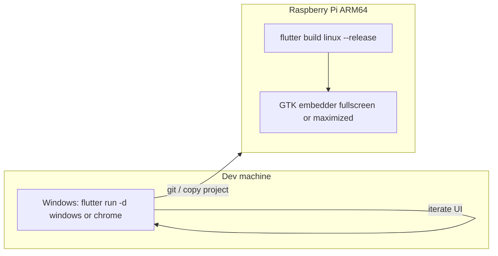
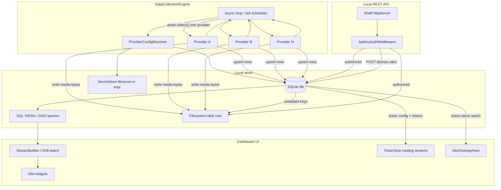

# Home dashboard (Flutter) for Raspberry Pi + TV

## Context

- [c:\dev\waddle-view](c:\dev\waddle-view) is the **mono-repo root** (currently almost empty: stub [README.md](c:\dev\waddle-view\README.md), Dart-style [.gitignore](c:\dev\waddle-view\.gitignore)). The **first application** will live under **`apps/waddle_view/`** after scaffold — not at repo root.
- You chose **Flutter** with a **TV shell MVP** that will grow; the product must **continuously collect** heterogeneous data, **persist structured state in SQLite**, **persist large binaries (pictures, videos, etc.) on the filesystem** behind a dedicated abstraction, **store provider configuration and secrets in a split model** (public/structured fields in SQLite; **credentials and tokens in OS-backed or otherwise protected secret storage**), run a **sequential “engine loop”** over pluggable providers, and **paint the dashboard from read models** (SQL views/queries that may expose **paths or content IDs** pointing at stored blobs — not giant rows in SQLite, and **not cleartext secrets**).
- The **main layout** includes a **bottom “ticker” strip** (horizontal **marquee-style motion** is optional polish; the core requirement is a **strip where ticker screens rotate in and out**). Each **screen** has **SQLite-backed configuration**: how long it stays visible (**dwell**), how long to wait before it may appear again (**cooldown / min interval**), **priority / sort order**, and **eligibility rules** that can depend on **current date/time**, **device-local timezone**, and **historical facts** such as **last time shown**, **shows today**, etc. Example: **weekends only** is expressed as data-driven rules, not hard-coded in widgets.
- **Non-functional requirements (mandatory)**:
  - **SOLID**: structure code so responsibilities stay small, abstractions are stable, and volatile details (windowing, future data sources) depend on interfaces you own — not the reverse.
  - **Test-first**: add or extend a **failing test** before production code for each behavior; keep the red–green–refactor loop tight.
  - **Coverage**: keep **unit-test line/branch coverage high** (concrete floor: **≥ 90% line coverage** on each Flutter app’s `lib/` — default **`apps/waddle_view/lib/`** — unless exempted with rationale); gate merges with `flutter test --coverage` + a checker (for example [`very_good_coverage`](https://pub.dev/packages/very_good_coverage) in CI, or an equivalent `lcov`-based threshold script).
  - **Secrets hygiene**: **no passwords, client secrets, or access/refresh tokens in Drift tables or plain logs**; configuration types and log statements are reviewed for accidental leakage (encode with tests where a DTO’s `toString` must not echo secrets).
  - **Mono-repo + agents**: new code and assistant work stay **scoped to the correct `apps/*` or `packages/*` tree**; **project rules and skills** are the source of truth for style and process so quality does not depend on a single conversation.
  - **Pi delivery**: users get a **documented install path** from CI-built **artifacts** (and optionally a **pre-baked SD image**); **upgrade** and **local development** workflows are written down so the system is operable without tribal knowledge.
  - **Local management API**: a **REST HTTP** surface on the Pi exposes **read/query** and **controlled write/update** paths over the same **SQLite + blob metadata** the dashboard uses, for automation and remote administration on the LAN. Access is **denied without** a **deployment-unique API key** (one key per installed image / device, not shared across downloads unless explicitly copied).
  - **Overlay alerts**: **temporary** messages that render **above** the normal dashboard and ticker (modal-style layer), until **`expires_at`** (optional **auto-dismiss**) and/or **`dismissed_at`** set by the **REST API**; content often includes a **QR code** (payload string, e.g. URL or opaque token) for off-device responses.

## Mono-repo layout

- **`apps/`**: one subdirectory per **runnable application** (first: **`apps/waddle_view`** — Flutter Linux TV dashboard). Future web services, CLIs, or other Flutter apps get their own `apps/<name>/` with isolated `pubspec.yaml`, tests, and CI.
- **`packages/`**: optional shared **Dart/Flutter libraries** (e.g. common models, client SDKs) consumed by multiple `apps/*`; add when duplication appears — consider [**Melos**](https://pub.dev/packages/melos) at the root for `bootstrap` / `exec` across packages once **two or more** Dart packages exist.
- **Root `README.md`**: index of applications, **one-line purpose** each, and **default commands** (`cd apps/waddle_view && flutter test`, etc.).
- **Root `.gitignore`**: union of patterns needed for **all** current and anticipated stacks (Flutter `build/`, `.dart_tool/`, `coverage/`, IDE, env files); avoid app-level ignores drifting out of sync.

## Agent and coding-assistant governance (Cursor / sub-agents / skills)

Goal: **consistent engineering** (SOLID, TDD, coverage, security, ticker/data architecture, **REST API hygiene**) as **many agents and humans** touch the repo over time.

- **[`AGENTS.md`](AGENTS.md) (repo root)**: mandatory **onboarding** for any agent or delegated sub-task: (1) **mono-repo** — default workdir **`apps/waddle_view`** for this product unless the task names another `apps/<app>`; (2) **test-first** and **≥90% line coverage** on that app’s `lib/`; (3) **secrets** only via `SecretStore`, never Drift cleartext; **deployment REST API keys** must never be committed — only documented **file paths** and install behavior; (4) **read** applicable **Project Rules** under `.cursor/rules/` before large edits; (5) run **`flutter analyze`** and **`flutter test --coverage`** from the **app directory** before claiming complete; (6) **sub-agents / Task prompts** must include **explicit path scope**, **deliverable**, and **forbidden paths** (e.g. do not modify `apps/other` without assignment).
- **[`.cursor/rules/*.mdc`](.cursor/rules/)**: codify non-negotiables in **Project Rules** with **`globs`** targeting `apps/waddle_view/**` (and later globs per app). Examples: SOLID ports, TDD order, Drift migration rules, ticker condition validation, logging redaction, dependency-adding policy.
- **[`.cursor/skills/`](.cursor/skills/)**: repo-local **Skills** (`SKILL.md` per skill) for repeatable workflows — e.g. “Add `IDataProvider`”, “Add ticker condition kind + migration”, “Add Drift VIEW + watch”, **“Add REST route + Shelf test”**, **“Add overlay alert type + API field”**. Each skill lists ** Preconditions**, **Steps**, **Tests to run**, and **Done criteria** so vibe-coded changes stay reviewable.
- **CI**: root [`.github/workflows/`](.github/workflows/) with **`paths` / `paths-ignore`** (or matrix per app) so **`apps/waddle_view`** gets `analyze`, `test`, and **coverage threshold** on every PR; extend when new `apps/*` appear. CI is the **shared bar** agents cannot skip.
- **Quality ownership**: when adding a **second application**, add an **app-specific rule file** (or globs) so agents do not apply Flutter-only conventions to, say, a Node service blindly.

## SOLID mapping (Flutter-friendly, practical)

- **S — Single responsibility**: separate **pure configuration / layout math** from **widgets**; separate **window chrome**, **collection orchestration**, **HTTP routing + request DTO mapping** from **domain repositories**, **ticker** concerns, **alert persistence + selection policy** (`AlertRepository`, which alert is “active”) from **alert overlay presentation** (`AlertOverlayHost` / widgets), **secret persistence** (`SecretStore`), **non-secret provider settings** (Drift/DAO), **config merge** (`ProviderConfigResolver`), **API key loading/validation** (`DeploymentApiKeySource`), **network/IO in a provider**, and **fact persistence** (repositories) so each class has one reason to change.
- **O — Open/closed**: extend behavior by adding **`IDataProvider`** / **`DashboardReadModel`** implementations and registering them; add **new ticker condition kinds** by extending a **registry** (or new rows referencing a **versioned** `kind` enum + validated params) without rewriting the rotation engine’s core loop — avoid editing the engine loop or shell core for each new source or rule type.
- **L — Liskov**: provider and repository fakes must satisfy the same contracts as production (e.g. errors translated to a recorded failure state, not divergent control flow).
- **I — Interface segregation**: small types — e.g. `IDataProvider`, `DashboardDataAccess`, **`BlobStore`**, **`SecretStore`**, **`ProviderConfigResolver`**, **`TickerScheduleRepository`** / **`TickerRotationController`** / **`TickerConditionEvaluator`**, **`LocalRestServer`** / **`ApiRequestHandler`** / **`DeploymentApiKeySource`**, `Clock` / `Sleeper` — instead of one mega-service.
- **D — Dependency inversion**: UI, schedulers, and **REST handlers** depend on **abstractions** (repositories, `DashboardDataAccess`, `IDataProvider` only where “trigger collect” is exposed behind a port); **Drift**, **libsecret-backed storage**, **`dart:io` File**, and **HTTP stack** live behind implementations; composition root wires **SQLite path**, **blob root**, **secret store**, **API key file path**, **`HttpServer.bind` host/port**, and providers.

## Test-first workflow (concrete order)

1. **Pure Dart first**: theme/padding; **collection policy**; **engine tick** sequencing; **ticker eligibility** (combine condition rows → boolean with `Clock` frozen in tests); **rotation / pick-next-screen** with dwell + cooldown from persisted history.
2. **Persistence tests**: **in-memory SQLite** for migrations, **VIEW** / query read models, upsert semantics; **blob tests** with **`FakeBlobStore`** or temp dirs; **`InMemorySecretStore`** for resolver/engine tests — assert **atomic replace**, missing keys, **no secret columns** in generated schema / fixture SQL dumps, and **redacted logging** contracts where applicable.
3. **Widget tests**: shell and tiles with **fake `DashboardDataAccess`**; **ticker strip** tests with **fake repository + controllable fake async clock**; **alert overlay** appears when active alert row present, **hides** after repository marks dismissed or **Clock** passes `expires_at`.
4. **Integration boundary**: `WindowChromeController` fakes; **provider fakes** (success, failure, timeout) to prove the loop never runs two collects concurrently; **Shelf** pipeline tests with **invalid/missing API key** → 401, **valid key** → expected JSON and repository calls.
5. **Composition** in `apps/waddle_view/lib/main.dart`: open DB, **`BlobStore`**, **`SecretStore`**, **`ProviderConfigResolver`**, register providers, **start/stop `LocalRestServer`** with shared executor, start/stop engine with app lifecycle, `runApp`.

## Architecture (high level)

- **Runtime on Pi**: Flutter’s **GTK Linux desktop** embedder (full Raspberry Pi OS desktop or kiosk session), not `flutter-pi` unless you later want DRM/KMS without a desktop — you explicitly picked the desktop-style path.
- **Builds**: Flutter does **not** offer a simple “build Linux ARM64 from Windows” path today. Practical options: (1) **`flutter build linux` on the Pi** (or another ARM64 Linux machine), (2) **ARM64 Linux container/CI** (e.g. Docker `--platform linux/arm64`), or (3) **self-hosted ARM64 runner**. The plan should document (1) as the default and mention (2) if builds on the Pi feel slow.

### Data plane (SQLite + engine loop + dashboard reads)

- **Overlay alerts**: **`DashboardShell`** (or root **`MaterialApp` builder**) uses a **`Stack`**: base = main dashboard + ticker; **top** = **`AlertOverlayHost`** listening to **`watchActiveAlert()`** (Drift query / `VIEW` of non-dismissed, non-expired rows — **expiry evaluated** using injected **`Clock`** in Dart or comparable rule in SQL). When an alert exists, show a **dimmed barrier** + **card** (TV-large text, optional **`qr_flutter`** `QrImageView` when **`qr_payload`** is non-empty). **Auto-dismiss**: `Timer` / periodic tick sets **`dismissed_at`** via repository or filters out expired in query only (prefer **explicit dismiss row** vs delete — audit); **API dismiss** sets **`dismissed_at`** through **`AlertRepository.dismiss(id)`**. **Stacking policy**: single **top-most by `priority`** for MVP, or document **queue** later.

- **Local REST API (management plane)**: embedded **HTTP server** (recommended: [**Shelf**](https://pub.dev/packages/shelf) + **`shelf_router`** + **`shelf_io`**) started/stopped with the Flutter app lifecycle. Handlers are **thin**: parse/validate request → call **existing repositories / application services** (same writes the UI would use) → map to JSON. **No ad-hoc SQL** in route files.
- **Authentication**: every mutating and sensitive read request requires **`X-Api-Key: <secret>`** or **`Authorization: Bearer <secret>`** (pick one in implementation, document both only if needed). Middleware compares using **constant-time** equality to the **deployment key** loaded from **`DeploymentApiKeySource`** (file path from env **`WADDLE_API_KEY_FILE`**, default e.g. **`/etc/waddle-view/api.key`**, **mode 0600**). Missing file → server refuses to start **or** listens only for health with 503 on data routes (policy choice — **test-first** the chosen behavior).
- **Per-deployment uniqueness**: **`install.sh`** (Tier 1) generates a **new random key** on first install (`openssl rand -hex 32` or similar), writes the file, **`chown`** to the service user. **Tier 2 images** may bake a key at image-build time **or** regenerate on first boot — document which; keys are **never** in git or release tarball metadata (only on device). **`docs/pi/api.md`**: how to read the key securely (SSH, `sudo`), rotate (replace file + restart), and **never** commit it.
- **Binding & exposure**: default **`127.0.0.1:<port>`** so only local processes reach the API unless explicitly configured for **LAN** (`0.0.0.0`) with firewall guidance in docs.
- **Concurrency**: HTTP handlers share the **same Drift isolate** as the UI and collection engine — all DB access still goes through **one `AppDatabase`** / repository layer; document **no long blocking** work on the HTTP isolate without `await` yielding; optional later **command queue** if write contention appears.

- **Bottom ticker strip**: a dedicated **footer region** of `DashboardShell` hosting **`TickerStrip`** (names illustrative). It **observes** Drift/`TickerScheduleRepository` for **eligible screens + payload** (text, optional blob-backed image, etc.) and runs a **small state machine** (idle → showing screen A for `dwell_ms` → gap / advance → evaluate next). **Horizontal scrolling/marquee** for long text can be a **later** `SingleChildScrollView` / `Marquee` enhancement; **rotation and eligibility** are the MVP contract.

- **SQLite stack (recommended default)**: [**Drift**](https://pub.dev/packages/drift) for schema, migrations, type-safe queries, and **`watch`** streams that rebuild the UI when stored facts change. On **Flutter Linux**, use the supported SQLite FFI path (per Drift docs for desktop — typically `sqlite3` + native libs bundled or system `libsqlite3`). Alternatives (`sqflite_common_ffi`, raw `sqlite3`) are acceptable if the team standardizes; the plan assumes **one** stack to keep tests and CI simple.
- **`IDataProvider` (port)**: each source implements a narrow contract, e.g. `Future<void> collect(DataWriteContext ctx)` — **no UI**. **`DataWriteContext`** exposes **repositories / `BlobStore` / `SecretStore` (or a per-provider token façade)** plus **`ProviderRuntimeConfig`** built for **that** tick (merged from Drift + secrets). Providers **write refreshed tokens** back via **`SecretStore`**, not via raw SQL string columns — **never** stuff large video into a SQL row; **never** persist bearer tokens in Drift.
- **`SecretStore` + `ProviderConfigResolver`**: **structured non-secret** settings (URLs that are safe to log without query strings, enable flags, intervals) live in **Drift**; **passwords, API keys, client secrets, access/refresh tokens** live in **`SecretStore`** under stable keys (e.g. `provider:{id}:refresh_token`). Resolver **merges** settings from Drift + `SecretStore` and is **fully unit-tested** with **`InMemorySecretStore`** and DB fakes.
- **`BlobStore` (port)**: e.g. `Future<BlobRef> put(Stream<List<int>> bytes, {required String logicalKey})`, `Future<File> openRead(BlobRef)`, `Future<void> delete(BlobRef)` — implementation uses a **stable root** (e.g. `.../waddle_view/media/`) with **sharded subfolders** (hash prefix) to avoid huge single directories; **write-to-temp-then-rename** for crash safety. **TDD** with in-memory fake + integration tests on temp dirs.
- **`DataCollectionEngine` (orchestrator)**: an **async loop** (not a busy `while(true)` spin on CPU) that on each **tick** selects **exactly one** provider, **`await`s** its `collect`, then persists; then advances to the next provider in **fixed registration order** (or policy-driven order — decide in implementation, but tests fix the policy). Between cycles, **`await` a configurable `Duration`** (inject **`Sleeper`/`Clock`** for TDD). This matches a **game-style update pass**: one system runs per step, deterministic ordering, easy to reason about under load.
- **Concurrency rule**: **never** overlap two `collect` calls; if a provider is slow, the rest wait — tests must prove this. Mitigate UI jank by keeping **per-provider budgets** (timeouts) and/or moving heavy CPU work **inside** the provider to an **`Isolate`** while the engine still awaits completion — document this as a provider responsibility.
- **Read models (“views”)**: define **SQL `VIEW`s** and/or **Drift queries** that **denormalize** facts for the dashboard, including **`blob_key` / resolved absolute path** where a tile shows **Image** / **video** widgets. The UI **only** reads through **`DashboardDataAccess`** (`Stream`/`Future` DTOs), not raw providers — **DIP**; widgets treat paths as **opaque** strings from the read model.
- **Lifecycle**: start the engine when the app enters a **running** state (`WidgetsBinding.instance` / `AppLifecycleState` or an explicit `AppController` started from `main`); **cancel** the loop on dispose/shutdown so tests and hot-restart do not leak tasks.

## Implementation steps

### 1. Mono-repo skeleton, agent files, and Flutter app scaffold

- **Directories**: create **`apps/waddle_view/`** (Flutter project), **`packages/`** (optional placeholder for future shared code), keep **`LICENSE`** at repo root as today.
- **Root `README.md`**: document mono-repo layout, **primary app** path, and commands always run from **`apps/waddle_view`** unless working on another app.
- **`AGENTS.md`**: per **Agent and coding-assistant governance** above (scope, TDD, coverage, rules, sub-agent prompts).
- **`.cursor/rules/`**: at least one **`mdc`** rule file with `globs` for `apps/waddle_view/**` restating mandatory process (SOLID, TDD, 90% coverage, secrets, no drive-by refactors).
- **`.cursor/skills/`**: initial skills for **add provider**, **add ticker condition kind**, **Drift migration**, **add alert + REST + overlay test** (minimal set; grow with pain points).
- **Root `.gitignore`**: merge root stub with **`flutter create`-compatible** patterns for nested apps (`**/build/`, `**/.dart_tool/`, `**/coverage/`, etc.); drop or narrow any **`*.js`** ignore that would break a future Flutter **web** app if added under `apps/`.
- **CI**: `.github/workflows/ci.yml` (or split workflows) with `paths` including `apps/waddle_view/**`, `deploy/**`, `docs/pi/**`, `.github/workflows/**` (and `packages/**` when Melos/libs exist) running `flutter analyze`, `flutter test --coverage`, and `very_good_coverage` (or equivalent) with `--min-coverage=90` against `apps/waddle_view/lib`. `release-pi.yml` may use a narrower `paths` filter plus an **ARM64** runner for release builds only.
- **Flutter**: run **`flutter create apps/waddle_view`** (adjust org/bundle id as desired); enable Linux desktop. All subsequent plan paths (`lib/`, `test/`, `linux/`) mean **`apps/waddle_view/lib/`**, etc.
- Set **`apps/waddle_view/pubspec.yaml`** **name** to something stable (e.g. `waddle_view`) and add a short **description**.
- Add **runtime** dependencies in the **app** `pubspec.yaml`: `drift`, `sqlite3` / Drift’s documented Linux companions; **`drift_dev`** + `build_runner`; **`flutter_secure_storage`** for Linux secret backend; **`shelf`**, **`shelf_router`**, **`shelf_io`**; **`qr_flutter`** (or maintained alternative) for **QR rendering** on alerts. Document **Pi/Linux** native deps (`libsecret`, D-Bus session) in **`apps/waddle_view/README.md`**.

### 2. Persistence layer (TDD first)

- **Schema**: normalized **fact tables** plus **SQL VIEWs** that project **dashboard read models**. Large media **metadata only** in SQLite: **`blob_key` / `sha256` / `relative_path` / `bytes` / `mime_type` / `captured_at`** — binary body lives under **`BlobStore`**. Add **provider_settings**-style tables for **non-secret fields only** (e.g. `base_url` without embedded key, `provider_type`, `enabled`, `poll_seconds`); **forbidden columns**: `password`, `api_key`, `access_token`, `refresh_token`, `client_secret` — enforced by schema review + tests that migrations contain no such names.
- **`AppDatabase` / DAOs**: all writes go through **repositories**; repositories coordinate **SQL + `BlobStore`** when an operation is transactional in business terms (e.g. “replace image”: write blob first or use a **tombstone + GC** policy — pick one strategy and **test failure modes**: DB updated but blob missing, blob written but DB rollback impossible without compensating delete).
- **Filesystem blobs**: implement **`BlobStore`** + **`FileSystemBlobStore`**; inject **root path** from `path_provider` (or equivalent) on Linux/Pi. Unit tests use **`FakeBlobStore`** or temp dirs; verify **concurrent-safe** usage assuming **only the engine** writes blobs during collect (aligns with single-writer loop); UI is **read-only** on blob files.
- **Tests**: in-memory DB for migrations; **VIEW** shapes; **blob** put/get/delete and orphan handling policy (even if MVP policy is “no GC yet”, document and test **explicit delete** paths).
- **File location on Pi**: separate **SQLite file** dir and **`media/`** blob root under the same writable app-data tree; document both in README; consider **SD card** path if user moves data (future note).

#### Dashboard overlay alerts (SQLite schema sketch, TDD)

- **`dashboard_alert`**: `id`, **`title`**, **`body`** (plain text MVP; markdown later if needed), nullable **`qr_payload`** (UTF-8 string encoded into QR — URL, `https://...`, or opaque token), **`severity`** (info / warning / critical for styling), **`priority`** (higher wins when multiple active — MVP may still show only one), **`created_at`**, nullable **`expires_at`** (null = no timeout), nullable **`dismissed_at`**, optional **`source`** (`api`, `system`).
- **Active selection**: **`VIEW v_dashboard_active_alert`** or Dart **`ActiveAlertSelector`** — filter `dismissed_at IS NULL` and `(expires_at IS NULL OR expires_at > :now)`; order by **`priority` DESC**, **`created_at` DESC**; take first. **TDD** selector with **frozen `Clock`** across DST boundary cases.
- **Expiry application**: either **repository sweep** on a short timer (mark dismissed or delete expired) or **pure filter** in query — pick one and test **no flicker** when expiry exactly equals `now`.

#### Ticker screens (SQLite schema sketch, TDD)

- **`ticker_screen`**: stable `id`, `sort_key` / priority, `enabled`, **`dwell_ms`** (how long the screen stays visible), **`min_gap_before_repeat_ms`** (minimum time since **end** of last showing before eligible again), optional `content_kind` + body fields or FK to blob/read model.
- **`ticker_condition_group`**: `screen_id`, `match_mode` (**ALL** = AND / **ANY** = OR of child rows).
- **`ticker_condition`**: `group_id`, **`kind`** (versioned string or int enum), **`params_json`** with a **strict per-kind schema** validated in Dart before insert/update — start with kinds such as **`weekday_in_set`** (e.g. Sat–Sun for “weekends”), **`local_time_between`**, **`date_between`**, **`min_cooldown_satisfied`** (uses history vs `min_gap_before_repeat_ms`), **`max_shows_per_local_day`**, **`expression_and`** (nested group id, optional for phase 2). **Avoid arbitrary eval** of user scripts in MVP; “highly configurable” means **many composable kinds + AND/OR groups**, not `eval()`.
- **History / state**: **`ticker_screen_display_log`** (`screen_id`, `started_at`, `ended_at`) or a compact **`ticker_screen_runtime`** (`last_started_at`, `last_ended_at`, `shows_on_local_day`, `local_day_key`) updated transactionally when a screen **starts** and **ends** — **TDD** the transitions so rules like “not again until Monday” and **max shows per day** read correct history.
- **SQL VIEW**: e.g. `v_ticker_screen_effective` joining screen + aggregated eligibility inputs for debugging; the runtime still uses **`TickerConditionEvaluator`** in Dart for clarity and tests (DB can pre-filter disabled rows).

#### Provider configuration and secrets (secure storage, TDD)

- **Threat model (pragmatic)**: defend against **cleartext secret theft from the SQLite file** and **accidental leakage via logs**; full **tamper resistance** against a root attacker on the device is **not** assumed unless you add hardware trust later.
- **`SecretStore` port**: e.g. `Future<String?> read(String key)`, `Future<void> write(String key, String value)`, `Future<void> delete(String key)` — production Linux impl via **`flutter_secure_storage`** (typically **libsecret** / Secret Service). Tests use **`InMemorySecretStore`** only.
- **`ProviderConfigResolver`**: given `providerId`, loads Drift row + required secret keys, returns **`ProviderRuntimeConfig`** (immutable DTO). **TDD** merge rules, missing-secret errors, and **per-field redaction** for any debug output.
- **OAuth / token refresh**: providers update tokens through **`SecretStore.write`**; add tests that **rotation** replaces old values and that failures surface as **provider errors** without printing secrets.
- **Pi / kiosk**: document that **D-Bus + secret service** (e.g. `gnome-keyring` / compatible service) must run for the default backend; if a headless image **lacks** Secret Service, document a **single explicit fallback** (e.g. encrypted file store with machine-local key — **weaker** model, README callout) rather than silent cleartext.

### 3. Data collection engine (TDD)

- Implement **`DataCollectionEngine`** with injected `List<IDataProvider>`, `AppDatabase`/write port, **`BlobStore`**, **`ProviderConfigResolver`** (or resolver inside context factory), `Clock`, `Sleeper`, and **policy**. Before each `collect`, **resolve config** for the active provider so **`DataWriteContext`** carries fresh **`ProviderRuntimeConfig`** and store ports.
- **Tests before implementation**: round-robin order; **no parallel** `collect`; failure in one provider **logs / records** and **continues** to next (policy choice — encode in tests); cancellation when `dispose` is called.
- Ship **one `NoOpDataProvider` or `StubDataProvider`** used only in tests / dev to validate the pipeline before real APIs exist.

### 4. TV-first layout and theme (MVP deliverable, TDD + SOLID)

- **Theme**: implement **`TvTheme` / `TvThemeData` (or equivalent) as pure construction** covered by unit tests (contrast, font sizes, `ThemeData` merge behavior) before wiring `MaterialApp.theme`.
- **Safe area / overscan**: implement **`TvOverscanInsets` (or similar) as pure functions** of `Size` / `EdgeInsets` + policy; tests lock edge cases (small vs large surfaces, minimum inset floor).
- **Orientation**: assume **landscape**; document OS-level rotation for Pi.
- **Shell structure** (extensible, **OCP/DIP**): a `DashboardShell` that takes **`List<DashboardSlotDescriptor>`** or an injectable **`DashboardLayoutPolicy`** interface, not hard-coded child trees scattered in `build()`.
  - **Header / body tiles**: bind to **`DashboardDataAccess.watchHeader()` / `watchSlot(id)`** (names illustrative) backed by Drift **`watch`** on VIEWs or compiled queries — **no** direct calls from widgets into providers.
  - **Bottom `TickerStrip`**: fixed height, TV-safe typography; uses **`TickerRotationController`** (or `TickerScheduler`) that **watches** ticker config/history (Drift stream or periodic refresh + diff) and drives **`AnimatedSwitcher` / `PageView` / custom slide** for “rotate in and out”. **Dwell**: `Future.delayed` / `Timer` with **cancel on dispose**; on show start and show end, call **`TickerScheduleRepository`** to **append log rows** or update runtime columns so **next** eligibility sees updated history.
  - **`AlertOverlayHost`**: **`Stack`** layer **above** header/body/ticker; **`StreamBuilder`** / Drift **`watch`** on active alert; **semantics** for screen readers; optional **on-device dismiss** control later (MVP can be **API-only** dismiss per product choice — if no physical dismiss, document that operators must call API or wait for timeout).
  - **`TickerConditionEvaluator`**: pure function (or class with injected **`Clock`**) mapping **`TickerEvaluationContext`** (now, local `DateTime`, per-screen history DTO) + screen row + condition rows → **eligible boolean**; exhaustive unit tests for **weekend**, **overnight time windows**, **cooldown**, **max per day**, and **empty OR group** edge cases.
  - Until real sources exist, **stub providers** can write **fixture rows** so the UI proves end-to-end **collect → SQLite → watch → render**; **seed ticker fixtures** the same way for ticker demos.
- File layout sketch: `lib/theme/`, `lib/dashboard/models/`, `lib/dashboard/widgets/`, **`lib/ticker/`**, **`lib/alerts/`** (repository, selector, overlay widgets), `lib/data/providers/`, `lib/data/engine/`, `lib/persistence/` (or `lib/database/`), `lib/window/` — tests mirror under `test/`.

### 5. Fullscreen / kiosk behavior (lightweight first pass, TDD)

- Define **`WindowChromeController`** (interface) with methods like `initialize`, `applyStartupPolicy` (names as you prefer); provide **`NoOpWindowChromeController`** for tests and non-Linux dev runs.
- **Tests first**: specify policy matrix (debug vs profile, Linux vs non-Linux) as unit tests on a small **`StartupWindowPolicy`** type (pure) plus a mocked controller verifying call order/count.
- **Implementation**: Linux concrete class uses **`window_manager`** internally; composition root selects impl. Avoid calling `window_manager` from untested static helpers.
- Document **fallback** without code: Pi OS kiosk autostart (see deployment step).

### 6. Local REST API (Shelf, deployment API key, TDD)

- **`DeploymentApiKeySource` (port)**: `Future<String?> load()` from file (trimmed single line) or env override for tests; **`FakeDeploymentApiKeySource`** for unit tests.
- **`ApiKeyAuthMiddleware`**: returns **401** with constant body (no key leakage); logs **request id + path** only, **never** the presented key.
- **Routing (MVP scope, extend by OCP)**: start with **read** endpoints aligned to **`DashboardDataAccess`** / read models (e.g. `GET /v1/health`, `GET /v1/ticker/screens`, `GET /v1/providers`); **write** endpoints for **non-secret** settings and **ticker configuration** (validated DTOs → repositories); **`GET /v1/alerts`**, **`POST /v1/alerts`** (create overlay: body, optional `qr_payload`, `expires_at`, `priority`, `severity`), **`DELETE /v1/alerts/{id}`** or **`POST /v1/alerts/{id}/dismiss`** (set `dismissed_at`); optional **`POST /v1/collect/{providerId}`** behind a port that delegates to **`DataCollectionEngine`** or a **one-shot collect** command (avoid re-entrancy — **serialize** with engine policy in tests). **Blob upload/download** can be **multipart** or **redirect to signed path** in a later iteration — document minimal MVP (metadata + small payloads) vs deferred binary streaming.
- **Response safety**: JSON serializers **redact** secret fields; integration tests assert **no** `refresh_token` in payloads.
- **Lifecycle**: bind **`HttpServer`** after DB ready; **`dispose`** on app shutdown closes the server **before** closing Drift.
- **`.cursor/skills/`**: add skill **“Add REST route”** (middleware, handler, repository call, shelf test).

### 7. Raspberry Pi deployment, release image build path, and documentation

#### 7a. Runtime prerequisites and manual build (developer / Pi owner)

Document in **`apps/waddle_view/README.md`** (short) with links to **`docs/pi/`**:

- **Pi prerequisites** (from Flutter Linux docs): typical dev packages (`clang`, `cmake`, `ninja-build`, `pkg-config`, GTK/libsecret, etc. — exact package names differ slightly Debian vs Raspberry Pi OS).
- **On-device compile**: clone the **mono-repo**, **`cd apps/waddle_view`**, **`flutter build linux --release`**; bundle under **`apps/waddle_view/build/linux/arm64/release/bundle/`** (path may vary by Flutter channel / arch).
- **Autostart**: **`~/.config/autostart/*.desktop`** or **`systemd` user unit** pointing at the installed binary inside the bundle; graphical session required for GTK embedder.
- **Session tips**: disable screen blanking / DPMS; optional **`window_manager`** fullscreen.

#### 7b. Release build path — installable artifact (Tier 1, MVP)

Goal: every **tagged release** (or `main` nightly, policy choice) produces a **downloadable artifact** users install on **stock Raspberry Pi OS (64-bit)** without compiling Flutter on the Pi.

- **Build host**: **ARM64 Linux** (GitHub **ubuntu-arm** runner, self-hosted Pi 4/5, or equivalent). **Do not** rely on cross-compiling Flutter Linux ARM64 from Windows (per earlier plan note).
- **Pipeline steps**: checkout → `cd apps/waddle_view` → `flutter pub get` → **`flutter build linux --release`** → assemble **`dist/waddle-view-linux-arm64-<version>/`** containing the **`bundle/`** tree plus **`install.sh`** (or `Makefile` target) that: creates **`/opt/waddle-view`** (or `/usr/local/waddle-view`), copies bundle, sets **`+x`** on the app binary, installs a **`systemd` user or system unit** `waddle-view.service` (Type=simple, `After=graphical-session.target` or `graphical.target` as appropriate), optional **`waddle-view.env`** for `DISPLAY` / `WAYLAND_DISPLAY`, **`WADDLE_API_KEY_FILE=/etc/waddle-view/api.key`**, and **creates `/etc/waddle-view/`** with a **fresh random API key** on first install (not overwritten on upgrade unless **`--rotate-api-key`** flag documented in **`docs/pi/upgrade.md`**).
- **CI workflow**: e.g. **`.github/workflows/release-pi.yml`** on **`push` tags `v*`** (and manual `workflow_dispatch`) with **`paths`** including `apps/waddle_view/**` and **`deploy/**`**; upload **`tar.gz`** or **`.zip`** + **SHA256 checksum** to **GitHub Releases** (or artifact store). Version string from **git tag** aligned with **`pubspec.yaml`**.
- **Repo layout**: add **`deploy/linux-arm64/`** (install script templates, unit file templates, `README` for maintainers). Scripts are **small**, testable where possible (shellcheck in CI optional).

#### 7c. Optional flashable SD image (Tier 2, roadmap)

- **Purpose**: single **`.img`** for Raspberry Pi Imager for factory-like deploys.
- **Approach** (choose when needed): **`pi-gen`** custom stage embedding Tier 1 tarball + first-boot script, or **Raspberry Pi OS** + **cloud-init** that downloads the release tarball and enables **`waddle-view.service`**. Document build host (**Debian/Ubuntu arm64**), **disk space**, and **30–60+ minute** CI cost; keep **Tier 1** usable if Tier 2 is delayed.

#### 7d. User and contributor documentation (`docs/pi/`)

Add **markdown** guides (root **`README.md`** links here prominently):

| Doc | Audience | Contents |
|-----|----------|----------|
| **`docs/pi/using-the-image.md`** | End user / installer | What artifact to download (Tier 1 tarball vs Tier 2 `.img` when available); verifying checksum; **flashing** (Raspberry Pi Imager steps for `.img`, or **copying** tarball to Pi); **first boot** (network, user, display); where data lives (SQLite, media dir); enabling autostart; changing default passwords; TV/kiosk tips; troubleshooting (black screen, Secret Service, logs via `journalctl --user -u waddle-view`). |
| **`docs/pi/upgrade.md`** | Operator | **In-place upgrade** (stop service → unpack new release over `/opt/...` or versioned dir + symlink flip → restart; **preserve** app data and `SecretStore`); schema migrations on app start; **rollback**; when to **re-flash** OS image; version compatibility notes. |
| **`docs/pi/development.md`** | Developer | Mono-repo layout; **`cd apps/waddle_view`**; dev on Windows vs Linux; **`flutter run -d windows`** / chrome vs **`linux`**; building on Pi; **tests + coverage** commands; CI expectations; link to **`AGENTS.md`** and **`.cursor/rules`**. |
| **`docs/pi/api.md`** | Operator / integrator | Base URL, **API key**, **`curl`** examples, **alert create/dismiss** + **QR payload** conventions, ticker/providers, **error codes**, **LAN bind** warning, key **rotation**, optional OpenAPI later. |

### 8. Quality bar for MVP

- **Pipeline real, sources can be stubbed**: the **engine + SQLite + `BlobStore` + read models + ticker + overlay alerts (QR) + UI binding + REST API (auth + core routes including alerts)** are production-shaped; providers may start as stubs that write **small fixture rows** and **tiny test blobs** (TDD-friendly).
- **`flutter analyze` clean** (no infos/warnings policy as you prefer for the repo).
- **Tests are not optional**: every new behavior ships with tests written **first**; PRs include coverage report or CI artifact.
- **Coverage gate**: maintain **≥ 90% line coverage on `apps/waddle_view/lib/`** (run commands from that directory) via `flutter test --coverage` + `very_good_coverage` (or equivalent). Document exemptions (e.g. generated `main` boilerplate if any) narrowly.

## Files you will touch or add (expected)

| Area | Path(s) |
|------|---------|
| Mono-repo + agents | [README.md](c:\dev\waddle-view\README.md), [AGENTS.md](c:\dev\waddle-view\AGENTS.md), [.cursor/rules/](c:\dev\waddle-view\.cursor\rules), [.cursor/skills/](c:\dev\waddle-view\.cursor\skills), [.github/workflows/](c:\dev\waddle-view\.github\workflows) |
| Pi release + docs | [docs/pi/](c:\dev\waddle-view\docs\pi) (`using-the-image.md`, `upgrade.md`, `development.md`, **`api.md`**), `deploy/linux-arm64/` (install templates, systemd unit, **api.key generation**) |
| Flutter app | `apps/waddle_view/pubspec.yaml`, `apps/waddle_view/lib/**`, `apps/waddle_view/linux/**`, `apps/waddle_view/test/**`, `apps/waddle_view/README.md` |
| Dashboard + data + API | Under `apps/waddle_view/`: `lib/dashboard/**`, `lib/ticker/**`, **`lib/alerts/**`**, `lib/theme/**`, `lib/data/**`, `lib/persistence/**`, `lib/window/**`, **`lib/api/**`** |
| Unit / widget tests | `apps/waddle_view/test/**`; `coverage/` under app (gitignored) |
| CI | `.github/workflows/*` — PR workflow (`apps/waddle_view`, analyze/test/coverage); **`release-pi.yml`** (ARM64 release build + artifact upload on tags) |
| App docs | `apps/waddle_view/README.md` — Pi build, autostart, SQLite, media, secrets/keyring, tests, ticker |
| Git | Root [.gitignore](c:\dev\waddle-view\.gitignore) — nested Flutter + future stacks |

## Out of scope for this MVP (later)

- **Production** third-party integrations (full OAuth UX, proprietary SDKs, etc.) — the **`SecretStore` + `ProviderConfigResolver` + interfaces + stub provider** prove the pipeline; add real providers incrementally. **Secure storage plumbing itself is in scope** for MVP.
- `flutter-pi` / embedded DRM unless you change direction away from desktop GTK.
- Cross-compiling Linux ARM64 from Windows without Docker/CI (non-trivial; not the default path).
- **Automated flashable full OS `.img` (Tier 2)** — optional after Tier 1 is stable; implement under something like **`deploy/pi-image/`** when prioritized (pi-gen / Imager custom image), not a blocker for first end-to-end Pi install.

## Risk / note

- **SQLite concurrency**: single writer pattern — engine and UI share one DB handle per Drift guidance; avoid ad-hoc isolate access to the same connection without Drift’s isolate APIs.
- **Disk space / SD wear**: media can exhaust storage; plan a later **quota + LRU eviction** policy; MVP can ship **manual delete** + logging when writes fail with `ENOSPC`.
- **Orphan blobs**: if DB insert fails after blob write (or vice versa), define **compensating actions** or **GC of unreferenced keys** — cover the chosen strategy with tests where feasible.
- **Sequential loop vs latency**: strict one-at-a-time ordering means a **slow or hung** provider blocks the whole wave; mitigate with **timeouts**, **per-provider isolates**, and **ordering** (cheap providers first) — encode the chosen policy in tests.
- **Secret Service unavailable**: `flutter_secure_storage` may fail on minimal images without D-Bus/session keyring; surface a **clear startup error** or use the documented **fallback** — never silently store secrets in SQLite.
- **Ticker time semantics**: rules use **device local time** unless you add explicit **timezone** columns later; document **DST** behavior (always `DateTime` local from `Clock`); misconfigured rules can **starve** a screen — tests for “no eligible screen” fallback (blank strip or default message).
- **ARM64 release builds**: if `flutter build linux --release` fails on Pi, check **directory permissions**, **Flutter stable**, and **RAM/swap**; document after first on-device build.
- **Agent scope drift**: contributors run **`flutter test` from repo root** by mistake or agents edit the wrong `apps/*`; mitigate with **AGENTS.md**, **rule globs**, and **CI `working-directory`** so failures are obvious.
- **Pi release CI**: ARM64 runners may be **rate-limited or absent** on free tiers — document **self-hosted runner** or **manual release build on a Pi** as fallback; **image builds** are slow and need **disk space** and **caching** strategy.
- **REST API exposure**: binding **`0.0.0.0`** without firewall exposes **management** to LAN attackers who can guess or intercept keys — default **`127.0.0.1`**, document **TLS termination** (reverse proxy) for untrusted networks; rate-limiting deferred but noted.
- **QR payloads**: URLs or tokens in alerts may be **guessable** if short — document **use of unguessable tokens** + HTTPS landing pages for sensitive flows; **never** put provider secrets in `qr_payload`.
