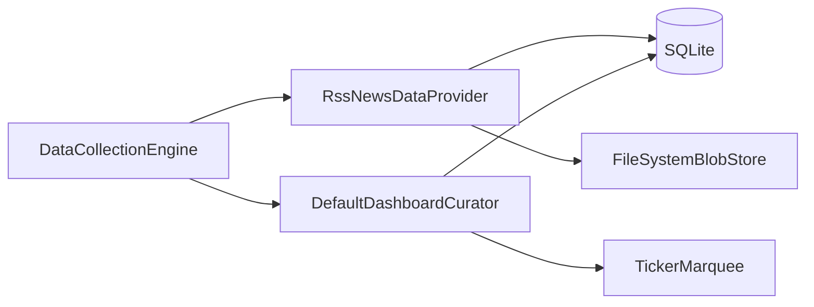

# RSS news data provider and curated ticker integration

## Current architecture (baseline)

- **[`DataCollectionEngine`](apps/waddle_view/lib/data/engine/data_collection_engine.dart)** runs each [`IDataProvider`](apps/waddle_view/lib/data/data_provider.dart) every engine cycle; **per-feed poll intervals** are best implemented **inside** the RSS provider by comparing `now` to each row’s `lastFetchedAt` and `pollSeconds` (no engine change required).
- **[`DefaultDashboardCurator`](apps/waddle_view/lib/curator/default_dashboard_curator.dart)** only reads KV via [`DriftCuratorReadPort`](apps/waddle_view/lib/curator/drift_curator_read_port.dart) and calls [`buildTickerItemsFromKv`](apps/waddle_view/lib/curator/ticker_curation.dart). That must **gain access to article rows** (extend read port + pure build function or a small compositor).
- **Blobs**: [`DataWriteContext.blobs`](apps/waddle_view/lib/data/data_write_context.dart) + [`BlobMetadata`](apps/waddle_view/lib/persistence/tables.dart) (pattern in [`StubDataProvider`](apps/waddle_view/lib/data/stub_data_provider.dart)).
- **Marquee speed**: [`TickerMarquee`](apps/waddle_view/lib/ticker/ticker_marquee.dart) defaults to **`pixelsPerSecond: 80`** ([`main.dart`](apps/waddle_view/lib/main.dart)). Scroll distance over time uses [`marqueeScrollDuration`](apps/waddle_view/lib/ticker/ticker_marquee_duration.dart): \(\text{distance} = \text{pixelsPerSecond} \times \text{seconds}\).

## 1. Schema (Drift)

Add new tables in [`tables.dart`](apps/waddle_view/lib/persistence/tables.dart) and register them in [`database.dart`](apps/waddle_view/lib/persistence/database.dart); bump **`schemaVersion` to 3** with `onUpgrade` creating the new tables.

**Suggested shape:**

- **`RssFeedSources`** (or `NewsFeedSources`): `id` (pk text), `url` (text), `category` (text, e.g. `local`, `national`, `world`, `tech`), `pollSeconds` (int, **default 3600** in Dart companions/migrations), `maxArticles` (int, **default 3**), `enabled` (bool), `lastFetchedAt` (int nullable, epoch ms), optional `title` (text, from feed metadata).
- **`RssArticles`**: `id` (pk text — stable from `feedId` + `guid` or hash), `feedId` (text, FK-style reference), `guid` (text), `title`, `link`, `summary` (nullable), `publishedAt` (int ms), `fetchedAt` (int ms), `imageBlobKey` (text nullable, matches [`blob_metadata`](apps/waddle_view/lib/persistence/tables.dart).`blobKey` when downloaded).

**Indexes**: at least `(feedId, publishedAt)` for “keep latest N” and ordering.

**Coverage**: `tables.dart` remains declarative; exclusions per [`AGENTS.md`](AGENTS.md) still apply to schema-only lines.

## 2. RSS provider (`IDataProvider`)

- New file under [`lib/data/providers/`](apps/waddle_view/lib/data/providers/) (per [`.cursor/skills/add-provider/SKILL.md`](.cursor/skills/add-provider/SKILL.md)), e.g. `rss_news_data_provider.dart`.
- **`id`**: e.g. `'rss'`.
- **`collect` flow**:
  1. Load enabled feeds from SQLite.
  2. For each feed where `lastFetchedAt == null` OR `now - lastFetchedAt >= pollSeconds`, fetch the feed URL with **`package:http`** (already in [`pubspec.yaml`](apps/waddle_view/pubspec.yaml)).
  3. Parse RSS/Atom using an **added** dependency (justify in commit: e.g. **`webfeed`** for RSS or **`xml`** for lower-level parsing).
  4. Upsert articles (dedupe by `guid`/link per feed).
  5. **Images**: detect image URL from item (`enclosure`, `media:content`, or first `` in description — keep scope minimal but robust for common feeds); `GET` bytes; `ctx.blobs.putBytes(..., logicalKey: 'rss/{feedId}/{articleId}/image')`; insert/update `blob_metadata` and set `imageBlobKey` on the article row. Failures should leave `imageBlobKey` null (no crash).
  6. **Retention**: after insert, **delete older rows** for that `feedId` so only the latest **`maxArticles`** remain (by `publishedAt` desc).
  7. Update `lastFetchedAt` for feeds that were fetched.
- Register **`ProviderSettings`** row** `id: 'rss'`** in [`initial_seed.dart`](apps/waddle_view/lib/seed/initial_seed.dart) (alongside `stub`) so [`ProviderConfigResolver`](apps/waddle_view/lib/config/provider_config_resolver.dart) resolves without error.
- Wire provider in [`main.dart`](apps/waddle_view/lib/main.dart): `providers: [StubDataProvider(), RssNewsDataProvider(), ...]` (order only affects round-robin).

**Tests** (TDD): `flutter test test/data/` — use [`openMemoryDatabase`](apps/waddle_view/test/helpers/memory_database.dart) + fake HTTP (inject a client or use a test-only parser path with fixture XML strings) so **no network** in CI. Assert articles + blob metadata when image URL is faked.

## 3. Curator: read port + ticker assembly

- Extend [`CuratorReadPort`](apps/waddle_view/lib/curator/curator_read_port.dart) with something like `Future<List<NewsArticleView>> loadNewsCandidatesForTicker()` (or return a small DTO: title, `feedId`, `category`, `publishedAt`). Implement in [`DriftCuratorReadPort`](apps/waddle_view/lib/curator/drift_curator_read_port.dart) via Drift queries (join feed for category).
- **Curator configuration (KV)** — same pattern as existing marquee keys in [`ticker_curation.dart`](apps/waddle_view/lib/curator/ticker_curation.dart):
  - `curator.ticker.newsScrollBudgetSeconds` — default **300** (5 minutes).
  - `curator.ticker.newsPixelsPerSecond` — default **80** to match [`TickerMarquee`](apps/waddle_view/lib/ticker/ticker_marquee.dart) unless `main.dart` is updated to read this key for the widget (recommended so budget and UI stay aligned).
  - Heuristic width estimate constants (defaults in code, optional KV overrides): e.g. `estimatedCharWidthPx`, separator padding — used only to approximate **how many text items fit** in `budgetPx = newsScrollBudgetSeconds * newsPixelsPerSecond` (non-Flutter, consistent with [`marqueeScrollDuration`](apps/waddle_view/lib/ticker/ticker_marquee_duration.dart) physics).

**Merge behavior:**

1. Keep existing **clock + KV marquee slots** (weather, quote, extras) from `buildTickerItemsFromKv` **or** refactor into: base items from KV **excluding** the single legacy `ticker.marquee.news` when curated RSS news is present (avoid duplicate “news” lines).
2. From DB candidates (latest-first globally): build an ordered list that **avoids two consecutive items from the same `feedId`** when possible (classic interleave / round-robin over per-feed deques sorted by `publishedAt`).
3. **Optional display**: prefix ticker body with `[Category]` from feed row so mixed categories are visible (configurable via KV boolean default on).
4. **Apply scroll budget**: walk the interleaved list; accumulate estimated label width per item until the sum exceeds `budgetPx`; emit that prefix as multiple `TickerItem`s with `kind: 'news'` and `sourceId: feedId` (adjacency rule already satisfied for the prefix).
5. **Fallback**: if no articles, keep current KV `ticker.marquee.news` behavior from stub/demo.

**Tests**: extend [`ticker_curation_test.dart`](apps/waddle_view/test/ticker_curation_test.dart) (or new `news_ticker_curation_test.dart`) with pure functions fed fake article rows — adjacency, budget cap, and “latest preferred” ordering.

## 4. UI alignment

- If `curator.ticker.newsPixelsPerSecond` is introduced, **thread it** into `TickerMarquee` from `main.dart` (parse int from merged KV in curator read or a tiny helper) so **5‑minute semantics** match on-screen scroll speed.

## 5. Operational notes

- **Feeds list**: starts empty unless you seed sample feeds in `initial_seed` (optional dev convenience). Production URLs belong in SQLite, not secrets.
- **Engine idle**: global [`idleBetweenCycles`](apps/waddle_view/lib/main.dart) remains; RSS work is gated per feed — frequent engine cycles are cheap when no feed is due.

## 6. Deliverables checklist

| Area | Action |
|------|--------|
| Schema | New tables + migration v3 |
| Provider | `RssNewsDataProvider` + seed `rss` `ProviderSettings` |
| Deps | RSS/XML package + justification |
| Curator | Read port + merge/budget/anti-adjacency |
| Config | KV keys + defaults; optional `TickerMarquee` wiring |
| Quality | `flutter analyze`, `flutter test --coverage`, `dart run tool/coverage_check.dart --min=90` |
