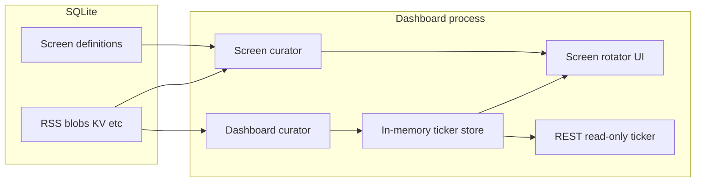

# Database, ticker memory, and screen rotation plan

## Current state (what went wrong)

- **[`tables.dart`](apps/waddle_view/lib/persistence/tables.dart)**: `TickerScreens`, `TickerConditionGroups`, `TickerConditions`, `TickerScreenRuntimes` model **ticker strip scheduling** (sort, dwell, conditions), not TV display screens. Naming + [`GET /v1/ticker/screens`](apps/waddle_view/lib/api/local_rest_server.dart) reinforced the confusion.
- **`TickerCuratedItems`**: Marquee text is **written by** [`DefaultDashboardCurator`](apps/waddle_view/lib/curator/default_dashboard_curator.dart) via [`DriftTickerCuratedRepository`](apps/waddle_view/lib/ticker/drift_ticker_curated_repository.dart) and **watched by** [`TickerMarquee`](apps/waddle_view/lib/ticker/ticker_marquee.dart). You want that **in memory only**; the API should expose the **current snapshot** read-only (no SQLite backing).

- **[`main.dart`](apps/waddle_view/lib/main.dart)**: The main area is still a placeholder `Center(Text(...))`; [`DashboardShell`](apps/waddle_view/lib/dashboard/dashboard_shell.dart) already reserves `Expanded` body above a fixed-height ticker—ideal for a screen carousel.

## Target architecture

### 1. Ticker: drop table, keep port, inject into REST

- Add **`MemoryTickerCuratedRepository`** implementing [`TickerCuratedRepository`](apps/waddle_view/lib/ticker/ticker_curated_repository.dart) (`replaceAll` + `watchOrdered` via `StreamController` or similar). **Delete** [`DriftTickerCuratedRepository`](apps/waddle_view/lib/ticker/drift_ticker_curated_repository.dart) (or keep only for tests if needed briefly during migration).
- Wire **`DefaultDashboardCurator`** + [`TickerMarquee`](apps/waddle_view/lib/ticker/ticker_marquee.dart) to the memory implementation.
- Extend [`buildRootHandler`](apps/waddle_view/lib/api/local_rest_server.dart) / [`buildProtectedApiRouter`](apps/waddle_view/lib/api/local_rest_server.dart) to accept the **same** `TickerCuratedRepository` (or a narrow `TickerReadPort` with `Future<List<TickerItem>> snapshot()` + optional stream) so **`GET /v1/ticker/items`** does not query Drift. No writes for ticker items over REST (already true).
- **Remove** `GET /v1/ticker/screens` as it stands today (it lists obsolete schedule rows). Replace later with screen definitions (below).

### 2. Remove obsolete ticker schedule tables

- Remove **`TickerScreens`**, **`TickerConditionGroups`**, **`TickerConditions`**, **`TickerScreenRuntimes`**, **`TickerCuratedItems`** from [`database.dart`](apps/waddle_view/lib/persistence/database.dart) / [`tables.dart`](apps/waddle_view/lib/persistence/tables.dart).
- **Migration** (`schemaVersion` bump): `DROP TABLE` in dependency order (children before parents), matching Drift’s expectations; regenerate **`database.g.dart`**.
- **Seed**: Remove [`tickerScreens` insert](apps/waddle_view/lib/seed/initial_seed.dart) for `welcome`; keep KV marquee keys as today (they drive ticker content, not “screens”).
- **Tests**: [`drift_ticker_curated_repository_test.dart`](apps/waddle_view/test/drift_ticker_curated_repository_test.dart) → memory repository tests. [`ticker_rotation_*`](apps/waddle_view/test/ticker_rotation_controller_test.dart), [`drift_ticker_schedule_*`](apps/waddle_view/test/drift_ticker_schedule_repository_test.dart): **delete or rewrite** against in-memory fakes—those modules ([`DriftTickerScheduleRepository`](apps/waddle_view/lib/ticker/drift_ticker_schedule_repository.dart), [`TickerRotationController`](apps/waddle_view/lib/ticker/ticker_rotation_controller.dart)) become unused once tables drop; either remove the code path or keep controller with a non-Drift schedule source only if you still want strip scheduling without DB (your requirements point to **removing** this layer).

### 3. New persistence: display screen definitions

Store **configuration** in SQLite; **runtime curation** stays in memory.

**Suggested tables** (names can be adjusted in implementation):

- **`screen_definitions`**: `id`, `name`, `description`, `enabled`, `layout_json` (versioned structure: e.g. grid/slots + widget tree), `dwell_ms`, **`frequency_weight`** (for weighted pick), **`min_gap_between_shows_ms`** (soft throttle across programs), optional **`max_random_selections`** per widget for data-driven widgets.
- **`curator_settings`** (single row or `dashboard_kv` keys): `program_duration_ms` (e.g. 180000), **`history_depth`** (e.g. 5), seeds/timezone if needed.

**Layout/widgets**: Start with a **small versioned JSON schema** (e.g. `{"v":1,"layout":"single","widgets":[{"type":"photo_carousel","slot":"main","config":{...}}]}`) and a **registry** mapping `type` → Flutter builder + data resolver. This avoids an explosion of join tables while staying queryable by tests. Expand to normalized tables later if needed.

**REST**: Add **`GET /v1/screens`** (list definitions + parsed JSON or ids for ops). Optionally **`GET /v1/screens/<id>`**—read-only matches “ticker API read-only” spirit for dashboards; **writes** can remain DB-only or be a later secured POST.

### 4. Screen curator (behavior)

- **Inputs**: Screen definitions from Drift, curator settings, **data pools** (e.g. photo blob keys from [`BlobMetadata`](apps/waddle_view/lib/persistence/tables.dart), RSS candidates via existing read ports where applicable).
- **Program**: Build an ordered list of **resolved screen instances** for the next `program_duration_ms` window: each entry = definition id + resolved payload (e.g. chosen photo ids), using **`dwell_ms`** per definition for timing sum ≤ window (trim or repeat definitions per strategy—codify explicitly in tests).
- **History**: Keep a **deque** of the last `history_depth` **shown** screens (ids + key random choices). When building the **next** program, bias selection **away** from recent ids (e.g. weighted penalty) and enforce **no duplicate random asset** within the same program for pools marked random (photos).
- **Orchestration**: A small state machine: `idle → playing_program → curate_next → playing_program`. Runs in the Flutter layer (e.g. `ScreenRotationController` + curator service), not in SQLite.

### 5. UI: body region transitions

- Replace the placeholder body in [`WaddleHome`](apps/waddle_view/lib/main.dart) with a **`ScreenRotator`** (new widget) occupying **`Expanded`** above the ticker in [`DashboardShell`](apps/waddle_view/lib/dashboard/dashboard_shell.dart).
- **Animation**: Match your description—**outgoing** slides **left**, **incoming** slides in **from the right** (standard stack carousel). Use `AnimationController` + `SlideTransition`/`FractionalTranslation` or a custom `PageRoute`-style transition with two children; drive index changes from the curator’s clock + `dwell_ms`.
- **Area**: Full remaining height above the ticker (already how `Column` + `Expanded` works).

### 6. Documentation and coverage

- Update [`ARCHITECTURE.md`](apps/waddle_view/ARCHITECTURE.md) sections that mention `ticker_curated_items` and ticker screens.
- **Coverage**: New pure curator logic + JSON parsing should be **unit-tested** (history depth, duplicate avoidance, program window). Follow **tests-first** for new behavior. Run `flutter test --coverage` and [`tool/coverage_check.dart`](apps/waddle_view/tool/coverage_check.dart) per [`AGENTS.md`](AGENTS.md).

## Assumptions (adjust if you disagree)

- **“How often displayed”** is modeled as **`frequency_weight`** + **`min_gap_between_shows_ms`**; exact tuning can live in curator tests.
- **Screen layout** is **JSON-first** with a version field and a small set of widget types in v1 (e.g. static text, photo from blob, placeholder).
- **REST**: Screen definitions are **readable** for integration; **mutation** of definitions is out of scope unless you want authenticated POST later.

## Risk / scope note

This touches **schema**, **REST**, **seed**, **marquee wiring**, **new UI**, and **many tests**. A pragmatic sequence is: **memory ticker + migration drop old tables + REST injection** (restore green tests), then **screen tables + seed + GET /v1/screens**, then **curator + rotator UI**.
