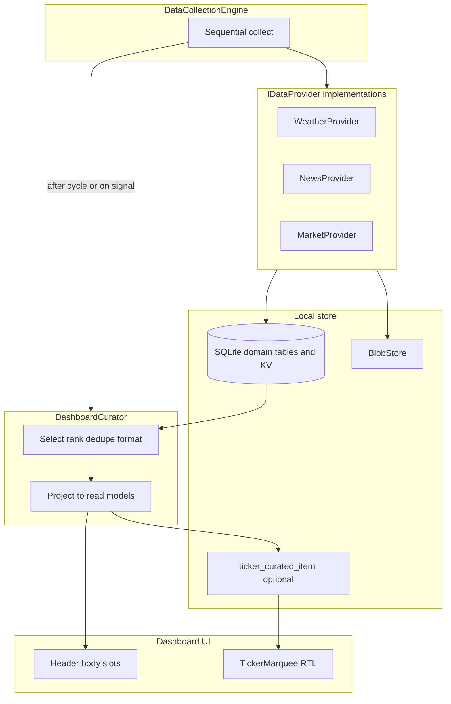

# Plan extension: marquee ticker + presentation curator

This document **extends** [`.cursor/plans/pi_tv_flutter_dashboard_149a9d38.plan.md`](c:\dev\waddle-view\.cursor\plans\pi_tv_flutter_dashboard_149a9d38.plan.md). It does **not** replace the mono-repo, persistence, engine loop, REST API, or overlay work already described there; it **refines the ticker UX** and adds an explicit **curation** boundary in the data plane.

## Gap vs current code

- The master plan’s ticker MVP emphasizes **SQLite-backed “screens”** with **dwell / cooldown / eligibility** ([`TickerRotationController`](c:\dev\waddle-view\apps\waddle_view\lib\ticker\ticker_rotation_controller.dart), Drift tables in [`tables.dart`](c:\dev\waddle-view\apps\waddle_view\lib\persistence\tables.dart)).
- [`TickerStrip`](c:\dev\waddle-view\apps\waddle_view\lib\ticker\ticker_strip.dart) today shows **one** label with ellipsis—**no** continuous scroll, **no** multi-item queue, **no** curator.
- This extension defines the **marquee behavior** and the **curator** so implementation can evolve from “single rotating label” to “curated stream of items” **without** collapsing provider and presentation responsibilities.

## Product behavior (ticker)

- **Motion**: content moves **right → left** along the bottom strip ([`DashboardShell`](c:\dev\waddle-view\apps\waddle_view\lib\dashboard\dashboard_shell.dart) already reserves a fixed-height ticker region).
- **Speed**: **constant linear velocity** in **logical pixels per second** (e.g. `TickerMarqueePolicy.pixelsPerSecond`), identical for every item regardless of text length (longer strings simply stay visible longer because they occupy more width).
- **Composition**: **ordered queue** of **ticker items** rendered **sequentially** in one horizontal run.
- **Separators**: a **fixed visual delimiter** between items (e.g. `·`, `|`, mid-dot, or a small pill) defined by theme/TV tokens—**not** part of provider raw strings (keeps redaction and localization consistent).
- **Looping**: when the leading edge of the queue exits left, **seamlessly** continue (classic pattern: **two copies** of the laid-out row, reset offset when the first copy has fully scrolled; alternative: `ListView` + `ScrollController` + computed jump—pick one and **test** wrap correctness).

## Presentation curator (new architectural role)

**Purpose**: **`IDataProvider`** implementations **collect and persist domain facts** (KV rows, typed tables, blob refs). The **curator** is the **only** place that decides **what appears on screen** from those facts: **which** rows, **in what order**, **how formatted**, and **when** they are stale. This matches your intent: *“constantly curated … selecting data collected by the data providers and populating the ticker items, screens layouts and widgets.”*

### Responsibilities

- **Read** normalized store / SQL VIEWs / repositories (never talk HTTP to third parties directly—keep network I/O in providers).
- **Write / refresh presentation models** the UI watches:
  - **Ticker**: ordered list of `TickerItem` (text, optional icon key, severity tint, `sourceId` for debugging).
  - **Dashboard slots / layouts**: slot-bound DTOs already implied by [`DashboardDataAccess`](c:\dev\waddle-view\apps\waddle_view\lib\dashboard\dashboard_data_access.dart) / [`DriftDashboardDataAccess`](c:\dev\waddle-view\apps\waddle_view\lib\dashboard\drift_dashboard_data_access.dart)—curator **projects** provider facts into those read models instead of widgets querying “everything.”
- **Policy**: caps (max headlines), de-duplication, freshness windows, fallbacks (“—” when empty), and **redaction** (never echo secrets in formatted strings).

### Non-responsibilities

- **No** provider credentials, **no** network calls (unless you later add an explicit, tested exception—default **no**).
- **No** ad-hoc SQL in widgets; curator uses **repositories / DAOs**.

### Triggering / lifecycle

- Run curator on a **debounced schedule** and/or after **domain writes** the engine cares about:
  - **Option A (simple)**: invoke `curator.refresh()` at the end of each successful `DataCollectionEngine` cycle (serial with collects—fits existing single-writer story).
  - **Option B (reactive)**: `Drift` **watch** on relevant tables → debounce → `refresh()` (snappier UI; more test surface).
- **Composition root** ([`main.dart`](c:\dev\waddle-view\apps\waddle_view\lib\main.dart)): wire curator next to engine + `DashboardDataAccess`.

### Suggested port(s)

- `abstract class DashboardCurator { Future<void> refresh(CuratorContext ctx); }` where `CuratorContext` exposes **read ports** (dashboard/ticker queries) and **write ports** (upsert curated ticker rows or in-memory channel—see persistence choice below).
- Keep **small** for MVP; split `TickerCurator` vs `LayoutCurator` later if files grow.

## Persistence options for curated ticker items

Pick **one** for MVP (document in plan / ADR in commit message):

1. **Dedicated table** `ticker_curated_item` (`ordinal`, `kind`, `body`, `updated_at`, optional `source_fingerprint`) — UI `watch`s rows; easy REST introspection; **TDD** migrations.
2. **Reuse `DashboardKv`** with a **key namespace** (`ticker.items.v1` JSON blob) — fewer tables; harder to query/partial-update; still testable.

Recommendation: **(1)** for clarity and REST alignment with the existing “ticker screens” story.

## Relationship to existing “ticker screens” / rotation

The master plan’s **`ticker_screen` + dwell + history** model solves **editorial scheduling** (“weekends only”, “max per day”). The marquee solves **within-strip presentation**. **Recommended coexistence**:

- **Screens / eligibility** (optional): gate **which segments or themes** enter the strip, or switch between **multiple marquee playlists** (advanced).
- **Marquee MVP**: curator always emits **one ordered list**; rotation controller can be **deprecated for the strip** once marquee ships, **or** reduced to “pick active playlist id” only—avoid two competing timers without a clear story.

Implementation note: until migration is complete, **feature-flag** or **single code path** in `TickerStrip` to prevent double animation.

## UI implementation sketch (Flutter)

- **`TickerMarquee`** widget: `ClipRect` + `Transform.translate` or `CustomPainter` / horizontal `flow`—driven by an **`AnimationController`** with:
  - `duration = (contentWidth / pixelsPerSecond).seconds`
  - linear curve → **constant velocity**
- **Layout**: `Row` of `[Item0][Sep][Item1][Sep]…` built from `List<TickerItem>`; measure total width (`LayoutBuilder` + `TextPainter` or `GlobalKey` after layout).
- **Accessibility**: `ExcludeSemantics` on moving duplicate if it creates noise; expose a **static** summary via `Semantics` (optional Pi/TV requirement).

## Data flow (updated)

## Test-first additions (align with AGENTS.md)

1. **Pure Dart**: curator mapping tests (fixtures in → ordered `TickerItem` list + separators count; redaction; stale row dropped).
2. **Marquee math**: velocity → duration from width; wrap reset threshold (golden or unit-tested helper).
3. **Widget tests**: pump `TickerMarquee` with fake list; **advance time** (`tester.pump` with frame time) and assert **separator** appears **between** items; assert **linear** progression (sample positions at two instants).
4. **Integration-light**: fake DB rows written as if provider ran → curator refresh → widget shows concatenated motion (optional once Drift watch path exists).

## REST / ops (optional follow-through)

- Extend [`docs/pi/api.md`](c:\dev\waddle-view\docs\pi\api.md) (when touched for this work) with `GET /v1/ticker/items` if curated rows are persisted—helps operators debug “what the TV thinks it should show.”

## `.cursor/skills` (when implemented)

- Add **“Add ticker item kind + curator mapping”** skill: migration (if new column/kind), evaluator tests, curator branch, widget snapshot guidelines.

## Risks / notes

- **Double timer conflict** if both rotation sleep-loop and marquee `AnimationController` drive the same strip—pick **one** driver for MVP.
- **Performance**: measuring text width each rebuild can be costly; cache invalidation keyed by `updated_at` / content hash.
- **DST / clock**: datetime items should use the same injected **`Clock`** as the rest of the app for tests.
