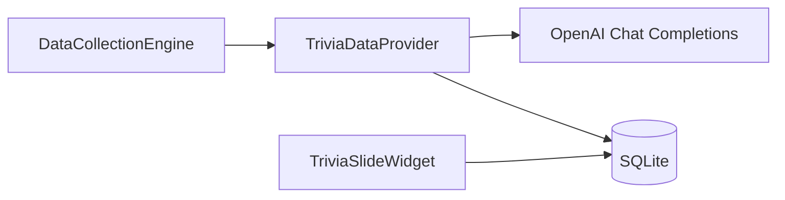

# Trivia questions (OpenAI + fade-out UI)

## Architecture (mirror jokes)

- **Persistence**: New tables in [`apps/waddle_view/lib/persistence/tables.dart`](apps/waddle_view/lib/persistence/tables.dart) (schema-only; excluded from coverage per repo rules):
  - `TriviaCategories`: same shape as `JokeCategories` but name inventory columns **`min_questions` / `max_questions`** (and optional `category_prompt`, seasonal fields) so prompts stay category-specific.
  - `TriviaQuestions`: `id`, `category_id` (FK), `question`, `option_a`…`option_d`, `correct_option` (store `'A'|'B'|'C'|'D'`), `created_at_ms`, indexes analogous to jokes.
  - `TriviaGenerationBatches`: same role as `JokeGenerationBatches` (`requested_at_ms`, `questions_requested`) for rolling-window caps.
- **Migration**: Bump [`apps/waddle_view/lib/persistence/database.dart`](apps/waddle_view/lib/persistence/database.dart) `schemaVersion` (e.g. 9 → 10) and in `onUpgrade` create the new tables when `from < 10`. Regenerate Drift (`dart run build_runner build --delete-conflicting-outputs` from `apps/waddle_view`).
- **Stable IDs**: New helper (e.g. [`apps/waddle_view/lib/data/providers/trivia_id.dart`](apps/waddle_view/lib/data/providers/trivia_id.dart)) hashing `categoryId + question + four options + correct` so `insertOnConflictUpdate` dedupes like jokes.

## Data layer (same behavior as jokes)

- **`TriviaProviderExtraConfig`**: Parallel to [`joke_provider_extra_config.dart`](apps/waddle_view/lib/data/providers/joke_provider_extra_config.dart): `questionsPerDay`, `model`, `globalPrompt`, temperature/max tokens, `maxQuestionsPerTwoHours`, `twoHourWindowMs`, `questionRetentionDays` (default similar to jokes).
- **`TriviaDataProvider`** ([`apps/waddle_view/lib/data/providers/trivia_data_provider.dart`](apps/waddle_view/lib/data/providers/trivia_data_provider.dart)):
  - `id` → `'trivia'`.
  - Same control flow as [`joke_data_provider.dart`](apps/waddle_view/lib/data/providers/joke_data_provider.dart): enabled check, `resolveConfig`, token required, daily cap, rolling sum from `TriviaGenerationBatches`, purge by retention, load categories, filter seasonal eligibility (copy the `isJokeCategoryEligibleOn` pattern for `TriviaCategory` rows—either a tiny shared helper using month/day fields or a duplicated 5-line function to avoid over-abstracting).
  - **Slot builder**: Copy [`joke_slot_allocation.dart`](apps/waddle_view/lib/data/providers/joke_slot_allocation.dart) to `trivia_slot_allocation.dart` with `TriviaCategory` / `min_questions` / `max_questions`.
  - **Prompt**: JSON array with one object per slot: `categoryId`, `question`, `A`, `B`, `C`, `D`, `correct` (`"A"`…`"D"`). Enforce family-friendly / factual tone in default `globalPrompt` (trivia suitable for a wall display).
  - **Parse/insert**: Reuse the same markdown-fence strip + `jsonDecode` list pattern; validate `correct`, non-empty strings, and `categoryId` in the allowed set; skip bad items.
- **Wire-up**: Register `TriviaDataProvider()` next to `JokeDataProvider()` in [`apps/waddle_view/lib/main.dart`](apps/waddle_view/lib/main.dart).

## Secrets / dev onboarding

- Tokens are per provider id: [`ProviderConfigResolver`](apps/waddle_view/lib/config/provider_config_resolver.dart) uses `provider:access_token:<id>`.
- Extend [`applyJokesTokenFromDevDotenv`](apps/waddle_view/lib/config/dev_dotenv_secrets.dart) (or add a small companion called from the same place) so when `OPENAI_API_KEY` / `WADDLE_JOKES_ACCESS_TOKEN` is present in debug, it **also** writes `provider:access_token:trivia` with the same value. Optional: support `WADDLE_TRIVIA_ACCESS_TOKEN` override if set.
- Seed [`initial_seed.dart`](apps/waddle_view/lib/seed/initial_seed.dart): `_ensureTriviaProviderRow` with `providerType: 'trivia'`, sensible default `extraJson`, and call `ensureDefaultTriviaCategories` + `_ensureTriviaScreen` (only insert if missing, matching joke patterns).

## Default categories

- New [`apps/waddle_view/lib/seed/trivia_category_seed.dart`](apps/waddle_view/lib/seed/trivia_category_seed.dart) with id/label/`category_prompt` entries such as: elementary math, world geography, pop culture, movies, celebrities, technology, science (plus 1–2 extras if useful for slot diversity). Non-seasonal by default; `min_questions` / `max_questions` aligned with joke defaults unless you prefer tighter inventory for trivia.

## UI: `trivia` slide widget

- Add [`apps/waddle_view/lib/dashboard/trivia_slide_widget.dart`](apps/waddle_view/lib/dashboard/trivia_slide_widget.dart):
  - Load one random row from `trivia_questions` (optional `categoryId` from `spec.config`, same as [`joke_slide_widget.dart`](apps/waddle_view/lib/dashboard/joke_slide_widget.dart)).
  - **Layout**: `LayoutBuilder` → `Stack`: main content centered (question + four labeled rows A–D); **countdown** in **`Positioned(top: …, right: …)`** (small label style from theme).
  - **Elimination window**: Derive total time from `slide.dwellMs` (e.g. `eliminationWindowMs = max(dwellMs - 1500, (dwellMs * 0.75).round())`) so the rotator still advances on schedule; optional override via `spec.config['eliminationWindowMs']` for tuning without code changes.
  - **Fade-out**: Shuffle the three **wrong** options; schedule timers so each wrong row’s `AnimatedOpacity` goes to `0` at evenly spaced times within the elimination window. The **correct** row stays at opacity `1` throughout.
  - **Countdown**: Integer seconds **until all wrong answers are fully hidden** (ceil of remaining ms / 1000); update on a 100–200 ms `Ticker` or short periodic timer so it tracks smoothly into 0 when the last wrong option finishes fading.
- Register `case 'trivia':` in [`screen_rotator.dart`](apps/waddle_view/lib/dashboard/screen_rotator.dart) `_SlideContent._buildWidgets`.
- Seed screen definition e.g. `id: 'trivia'`, `layoutJson` with `{"type":"trivia","slot":"main","config":{}}`, `dwellMs` long enough for readability (e.g. 14–18s; jokes use 12s).

## Tests and coverage

- **TDD order** (per project rules): add failing tests first, then implementation.
- **`trivia_slot_allocation_test.dart`**: Port the three tests from [`joke_slot_allocation_test.dart`](apps/waddle_view/test/data/joke_slot_allocation_test.dart).
- **`trivia_data_provider_test.dart`**: Port key scenarios from [`joke_data_provider_test.dart`](apps/waddle_view/test/data/joke_data_provider_test.dart) (happy path insert, daily cap, invalid JSON skipped, unknown category skipped). Use `openMemoryDatabase` / `warmDatabase` and extend warm/migration helpers if tests need schema v10.
- **`trivia_slide_widget_test.dart`**: In-memory DB with one question; pump widget; assert countdown visible; advance time with `tester.pump` to observe wrong options hitting opacity 0 and only correct label remaining; golden not required.
- Run `flutter test --coverage` and `dart run tool/coverage_check.dart --min=90` from `apps/waddle_view`.

## Files touched (summary)

| Area | Files |
|------|--------|
| Schema / DB | `tables.dart`, `database.dart`, generated `database.g.dart` |
| Provider | `trivia_data_provider.dart`, `trivia_provider_extra_config.dart`, `trivia_slot_allocation.dart`, `trivia_id.dart`, optional `trivia_seasonal_eligibility.dart` |
| UI | `trivia_slide_widget.dart`, `screen_rotator.dart` |
| Seed / bootstrap | `trivia_category_seed.dart`, `initial_seed.dart`, `main.dart`, `dev_dotenv_secrets.dart` |
| Tests | New tests under `test/data/` and `test/dashboard/` |

## Non-goals (keep scope tight)

- No shared generic “OpenAI category provider” refactor unless you explicitly want it later.
- No new third-party packages; use existing `http`, Drift, Flutter animations.
- No README/plan markdown edits unless you ask for documentation updates.
