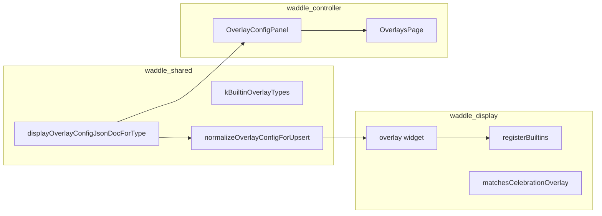

# Add display overlay (built-in type)

Repo constraints: [AGENTS.md](../../../AGENTS.md) (tests-first; Drift migration only if `overlay_types` / `overlays` table shape changes; update docs when operator-facing behavior changes).

## Related skills

- [controller-dialog-submit](../controller-dialog-submit/SKILL.md) — Save/Create dialog UX in [`OverlayDialog`](../../../apps/waddle_controller/src/pages/OverlaysPage.tsx)
- [schema-config-form](../schema-config-form/SKILL.md) — RJSF widgets for schema-only overlay configs

## Forbidden

- Do not edit unrelated `apps/*` unless the task names them.
- **Plugin overlays** (`plugin_template_overlay`, `plugin_web_overlay` in [`overlay_widget_registry.dart`](../../../apps/waddle_display/lib/extensions/overlay_widget_registry.dart)) — use the plugin SDK / a separate task.
- **Curator pages** — overlays are **assigned** via curator program `[overlays]` membership; verify assignment when testing, do not reimplement curator UI here.

## Architecture



- **Rows**: SQLite **`overlays`** (`id`, `overlay_type`, `label`, `config_json`).
- **Type catalog**: **`overlay_types`** seeded from code via [`ensureOverlayTypes`](../../../packages/waddle_shared/lib/seed/tables/overlay_types_seed.dart).
- **REST**: `POST` / `PATCH` `/v1/display/overlays`; blob upload `POST /v1/display/overlays/blobs`; schemas in `GET /v1/meta/config-schemas` → `overlay_types`.
- **Runtime**: [`OverlayWidgetRegistry`](../../../apps/waddle_display/lib/extensions/overlay_widget_registry.dart) builds celebration layers; [`matchesCelebrationOverlay`](../../../apps/waddle_display/lib/display/overlay/celebration_overlay_schedule.dart) respects optional `config_json.trigger` (`signal` / `when`).
- **Z-order**: `static_image`, `digital_clock`, and `analog_clock` render **before** other types (see `typeOrder` in the registry).

## Decision tree

| Pattern | When | Shared | Display | Controller |
|--------|------|--------|---------|------------|
| **Schema-only** | Sliders, enums, booleans; no blob upload | `displayOverlayConfigJsonDocForType` only | Widget + `registerBuiltins` | [`OverlayConfigPanel`](../../../apps/waddle_controller/src/components/config/OverlayConfigPanel.tsx) → default [`SchemaConfigForm`](../../../apps/waddle_controller/src/components/config/SchemaConfigForm.tsx) |
| **Normalize + parse** | Strict shape, defaults, coercion | `display_overlay_*_settings.dart` + [`normalizeOverlayConfigForUpsert`](../../../packages/waddle_shared/lib/persistence/display_overlay_repository.dart) | `*ScheduleSettings.parse` / settings class | Bespoke form if RJSF is insufficient |
| **Blob-backed** | `image_blob_keys` or single blob key | Schema `items.format: waddle-overlay-blob-key` | [`readDisplayBlobBytes`](../../../packages/waddle_shared/lib/blob/display_blob_read.dart) in widget — never raw `readBytes` on display | `FallingImagesConfigForm` / `StaticImageConfigForm`; extend [`extractOverlayBlobKeys`](../../../apps/waddle_controller/src/util/extractOverlayBlobKeys.ts) and [`remapOverlayBlobKeys`](../../../apps/waddle_controller/src/api/catalogTransfer/remapOverlayBlobKeys.ts) for catalog copy |
| **Placement** | Fixed viewport position (clock, watermark) | [`display_overlay_clock_placement.dart`](../../../packages/waddle_shared/lib/persistence/display_overlay_clock_placement.dart) | [`clock_overlay_layout.dart`](../../../apps/waddle_display/lib/display/overlay/clock_overlay_layout.dart) | `*ClockOverlayConfigForm` + [`ClockOverlayPlacementFields`](../../../apps/waddle_controller/src/components/config/ClockOverlayPlacementFields.tsx) |
| **Curator phrases** | Optional `messages[]` on celebration types | `_splitOverlayConfigForNormalize` / merge in repository | `ctx.mergePhrases` in registry builder | Strip `messages` from bespoke submit payloads where needed (see `overlayConfigForSubmit` for `falling_images`) |

## Checklist

1. **Type id** — Add `kOverlayType*` constant and entry in [`kBuiltinOverlayTypes`](../../../packages/waddle_shared/lib/persistence/tables.dart).
2. **Schema + example** — Branch in [`displayOverlayConfigJsonDocForType`](../../../packages/waddle_shared/lib/persistence/config_json_documentation.dart); extend [`config_json_documentation_test.dart`](../../../packages/waddle_shared/test/persistence/config_json_documentation_test.dart).
3. **Label** — Add to [`kOverlayTypeTitles`](../../../packages/waddle_shared/lib/persistence/overlay_type_label.dart) (keep in sync with controller [`overlayTypeLabel.ts`](../../../apps/waddle_controller/src/util/overlayTypeLabel.ts)).
4. **Persistence normalize** — If validation beyond generic JSON: settings module + `normalizeOverlayConfigForUpsert` switch case + test under `packages/waddle_shared/test/persistence/`.
5. **Display widget** — `apps/waddle_display/lib/display/overlay/<name>_overlay.dart` + tests in `test/display/overlay/`.
6. **Registry** — `registry.register(...)` in [`registerBuiltins`](../../../apps/waddle_display/lib/extensions/overlay_widget_registry.dart); return `null` when config is empty or unrenderable (see `falling_images`, `floating_balloons`).
7. **Controller UI** — Branch in [`OverlayConfigPanel.tsx`](../../../apps/waddle_controller/src/components/config/OverlayConfigPanel.tsx); if needed, update `overlayConfigForSubmit` / `overlayConfigForForm` / `configPreview` in [`OverlaysPage.tsx`](../../../apps/waddle_controller/src/pages/OverlaysPage.tsx); optional `*ValidationSchema` in `src/util/`.
8. **Icon** — Map in [`overlayTypeIcon.tsx`](../../../apps/waddle_controller/src/util/overlayTypeIcon.tsx).
9. **Optional seed** — Idempotent overlay row in [`initial_seed.dart`](../../../packages/waddle_shared/lib/seed/initial_seed.dart) + blob seed if assets are required.
10. **Docs** — [`apps/waddle_display/README.md`](../../../apps/waddle_display/README.md) overlay section; controller README only if operator workflow changes.

## Canonical examples

| Example | What to copy |
|--------|----------------|
| **Schema-only** | `matrix_rain`, `edge_glow` — doc + registry; panel uses `SchemaConfigForm` |
| **Bespoke + blobs** | `falling_images` — [`FallingImagesConfigForm`](../../../apps/waddle_controller/src/components/config/FallingImagesConfigForm.tsx), repository normalize, blob keys |
| **Placement** | `digital_clock`, `analog_clock` — shared placement, registry z-order, clock config forms |
| **Operator create** | [`OverlayDialog`](../../../apps/waddle_controller/src/pages/OverlaysPage.tsx) — type locked on edit; follow [controller-dialog-submit](../controller-dialog-submit/SKILL.md) |

## Verification

```bash
# Shared
cd packages/waddle_shared && flutter test test/persistence/config_json_documentation_test.dart
cd packages/waddle_shared && flutter test test/persistence/display_overlay_*_test.dart

# Display
cd apps/waddle_display && flutter test test/display/overlay/

# Controller (if schema helpers touched)
cd apps/waddle_controller && npm run lint
cd apps/waddle_controller && npm run test:coverage -- src/util/schemaConfigForm.test.ts
```

Full CI parity: [run-waddle-checks](../run-waddle-checks/SKILL.md).

**Manual**: create overlay in controller → Save disables button → display shows effect when overlay is on an active curator program.
