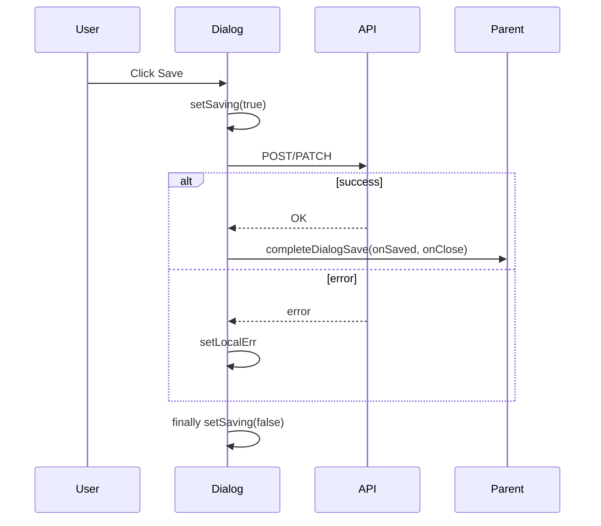

# Controller dialog submit UX

Repo constraints: [AGENTS.md](../../../AGENTS.md); rule summary in [waddle-controller.mdc](../../rules/waddle-controller.mdc).

## When to apply

Any MUI `Dialog` (or modal) whose primary action performs an **async API** call:

- Display REST via `apiFetch` / proxy
- BFF (`bffClient`, `createBffUser`, etc.)
- Adoption (`completeAdoption`, `confirmAdoption`)

## Checklist

1. **State**: `const [saving, setSaving] = useState(false)` (or reuse existing `busy`).
2. **Validation first**: return early on client errors; call `setSaving(true)` only after validation passes.
3. **Try/finally**: `try { await api...; await completeDialogSave(onSaved, onClose); } catch { setErr(...); } finally { setSaving(false); }`.
4. **Primary button**: `disabled={saving || ...existingValidation}` and `{saving ? 'Saving...' : 'Save'}` (use `Creating...` / `Confirming...` for create/confirm flows).
5. **Form children**: pass `disabled={saving}` to [`SchemaConfigForm`](../../../apps/waddle_controller/src/components/config/SchemaConfigForm.tsx), config panels, switches where the component supports it.
6. **Initial load**: separate `loading` for fetch-on-open; show body placeholder while loading; do **not** wire Save to `loading`.
7. **Cancel**: may stay enabled (canonical: [`ScreenDialog.tsx`](../../../apps/waddle_controller/src/components/screens/ScreenDialog.tsx)).

## Submit flow



## Template

```ts
import { completeDialogSave } from '@/util/dialogSave';

const [saving, setSaving] = useState(false);
const [err, setErr] = useState<string | null>(null);

const submit = async () => {
  setErr(null);
  if (!/* validation */) {
    setErr('...');
    return;
  }
  setSaving(true);
  try {
    await apiFetch(/* ... */);
    await completeDialogSave(onSaved, onClose);
  } catch (e) {
    setErr(e instanceof ApiError ? `${e.status}: ${e.message}` : String(e));
  } finally {
    setSaving(false);
  }
};
```

```tsx
<DialogActions>
  <Button onClick={onClose}>Cancel</Button>
  <Button variant="contained" onClick={() => void submit()} disabled={saving}>
    {saving ? 'Creating...' : 'Create'}
  </Button>
</DialogActions>
```

## Anti-patterns

- `disabled={loading}` on Save when `loading` only tracks **initial fetch** (see [`CuratorsPage.tsx`](../../../apps/waddle_controller/src/pages/CuratorsPage.tsx). use `saving` for submit).
- Omitting `finally { setSaving(false) }` so the button stays disabled after errors.
- Closing the dialog before the API succeeds (except auth flows that clear session state explicitly).
- Showing **id** fields or raw **config_json** monospace text areas in catalog add/edit dialogs.

## Catalog entity dialogs (screens, overlays, ticker tapes)

Fixed field order for create and edit:

1. **Label** (required on create; id derived server-side; preview with [`catalogIdFromLabel.ts`](../../../apps/waddle_controller/src/util/catalogIdFromLabel.ts))
2. **Description** (optional multiline)
3. **Type** (empty `Select` + "Select ... type" on create; disabled on edit)
4. Scheduling / shell fields (dwell, weight, enabled, ...)
5. Type config via [`SchemaConfigForm`](../../../apps/waddle_controller/src/components/config/SchemaConfigForm.tsx) or bespoke overlay panels. **Never** paste raw JSON.

Use [`DurationInputField`](../../../apps/waddle_controller/src/components/DurationInputField.tsx) for operator-facing seconds stored in the DB. Ticker tapes use [`TickerConfigPanel`](../../../apps/waddle_controller/src/components/ticker/TickerConfigPanel.tsx).

## Canonical examples

- [`ScreenDialog.tsx`](../../../apps/waddle_controller/src/components/screens/ScreenDialog.tsx): create/edit screen
- [`OverlaysPage.tsx`](../../../apps/waddle_controller/src/pages/OverlaysPage.tsx): `OverlayDialog` (new overlay **types**. See [add-display-overlay](../add-display-overlay/SKILL.md))
- [`TickerPage.tsx`](../../../apps/waddle_controller/src/pages/TickerPage.tsx): add/edit ticker tape dialogs

## Helper

[`completeDialogSave`](../../../apps/waddle_controller/src/util/dialogSave.ts) awaits `onSaved` then `onClose`. Unit tests: [`dialogSave.test.ts`](../../../apps/waddle_controller/src/util/dialogSave.test.ts).

## Verification

```bash
cd apps/waddle_controller
npm run lint
```

Manually: open dialog → Save → button disables and label changes → dialog closes on success; on forced error, dialog stays open and button re-enables.
