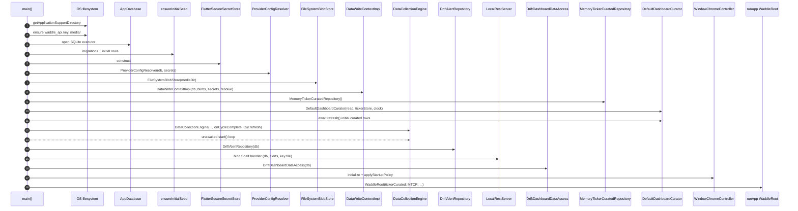
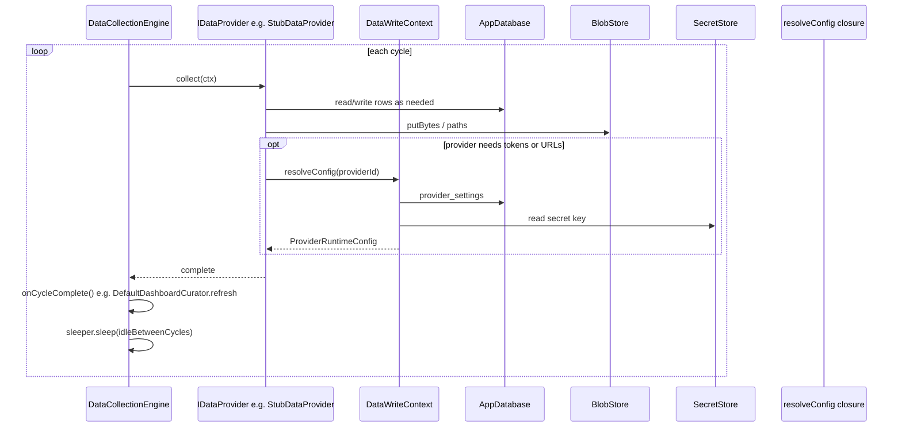
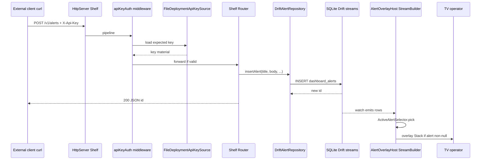
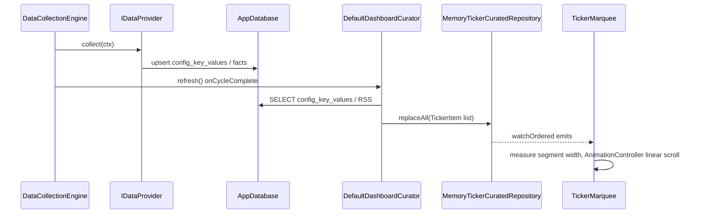

# waddle_display architecture

This document describes how the TV dashboard is structured at runtime and how major subsystems interact. The **composition root** is [`lib/main.dart`](lib/main.dart); feature code is grouped by responsibility under [`lib/`](lib/).

## Design goals

- **Single process**: Flutter UI, background async loops, and the embedded HTTP server share one isolate unless you add isolates later.
- **Ports and adapters**: abstract boundaries (`IDataProvider`, `DataWriteContext`, `AlertRepository`, `TickerCuratedRepository`, `DashboardCurator`, `BlobStore`, `SecretStore`, `WindowChromeController`) with Drift/filesystem/Linux implementations.
- **No secrets in SQLite**: provider tokens and similar values go through [`SecretStore`](lib/secrets/secret_store.dart); SQLite holds non-secret configuration and operational data.
- **Drift as the hub**: display **screen definitions** (`screen_definitions`), **configuration key–values** (`config_key_values`, including curator program settings and theme/ticker keys), alerts, blob metadata, RSS tables, and provider settings read/write through [`AppDatabase`](lib/persistence/database.dart). **Ticker marquee text is in-memory only** ([`MemoryTickerCuratedRepository`](lib/ticker/memory_ticker_curated_repository.dart)); REST exposes a read-only snapshot.

## Module map

High-level dependency direction (arrows read as “uses” or “writes through”):

```mermaid
flowchart TB
  subgraph composition["Composition root (main.dart)"]
    Main[main / WaddleRoot / WaddleHome]
  end

  subgraph ui["Presentation"]
    Shell[DashboardShell]
    Overlay[AlertOverlayHost]
    Strip[TickerMarquee]
    Rotator[ScreenRotator]
    Chrome[WindowChromeController]
  end

  subgraph async_loops["Background-style async loops"]
    Engine[DataCollectionEngine]
    Curator[DefaultDashboardCurator]
  end

  subgraph api["Embedded HTTP"]
    Server[LocalRestServer + Shelf]
    Handlers[buildRootHandler / routers]
  end

  subgraph ports["Ports (abstract)"]
    IData[IDataProvider]
    DWC[DataWriteContext]
    AR[AlertRepository]
    TCR[TickerCuratedRepository]
    DDA[DashboardDataAccess]
    BS[BlobStore]
    SS[SecretStore]
    Keys[DeploymentApiKeySource]
  end

  subgraph adapters["Adapters (concrete)"]
    Stub[StubDataProvider]
    DAR[DriftAlertRepository]
    MTCR[MemoryTickerCuratedRepository]
    DDAD[DriftDashboardDataAccess]
    FSB[FileSystemBlobStore]
    FSS[FlutterSecureSecretStore]
    FKS[FileDeploymentApiKeySource]
    DB[(AppDatabase / SQLite)]
  end

  Main --> Shell
  Main --> Overlay
  Main --> Strip
  Main --> Rotator
  Main --> Chrome
  Main --> Engine
  Main --> Curator
  Main --> Server

  Shell --> DDA
  Overlay --> AR
  Strip --> TCR

  Server --> Handlers
  Handlers --> DB
  Handlers --> TCR
  Handlers --> AR
  Handlers --> Keys

  Engine --> IData
  Engine --> DWC
  Stub -. implements .-> IData
  Stub --> DWC
  DWC --> DB
  DWC --> BS
  DWC --> SS

  Curator --> TCR
  MTCR -. implements .-> TCR
  DAR -. implements .-> AR
  DDAD -. implements .-> DDA
  FSB -. implements .-> BS
  FSS -. implements .-> SS
  FKS -. implements .-> Keys
  MTCR -. in-memory .-> TCR
  DAR --> DB
  DDAD --> DB
  Engine --> Curator
```

## Composition and lifecycle

At startup, `main()` wires concrete implementations, starts long-running `Future`s with `unawaited`, then calls `runApp`. On `WaddleHome` dispose, the data engine stops, the Shelf server closes, and the database closes.

## Sequence: application startup

From [`lib/main.dart`](lib/main.dart): filesystem prep → database + seed → secrets and data context → **curator initial `refresh()`** → collection engine (with **`onCycleComplete: curator.refresh`**) → alerts + REST (`MemoryTickerCuratedRepository` for **`GET /v1/ticker/items`**) → dashboard access + **`TickerMarquee`** + **`ScreenRotator`** → window policy → `runApp`.

## Sequence: data collection cycle

[`DataCollectionEngine`](lib/data/engine/data_collection_engine.dart) walks the configured [`IDataProvider`](lib/data/data_provider.dart) list in order, awaits each `collect`, then sleeps `idleBetweenCycles` (shorter in debug builds). Providers must not run overlapping collects; the engine enforces one in flight.

The stub provider demonstrates the path: it upserts [`config_key_values`](lib/data/stub_data_provider.dart) (feeds the header title stream) and registers a small blob plus [`blob_metadata`](lib/data/stub_data_provider.dart).

## Sequence: REST alert to on-screen overlay

Shelf runs the [`buildRootHandler`](lib/api/local_rest_server.dart) pipeline: public `GET /v1/health`, then API-key middleware and the protected router. [`DriftAlertRepository.insertAlert`](lib/alerts/drift_alert_repository.dart) inserts a row; Drift’s `watch()` drives [`AlertOverlayHost`](lib/alerts/alert_overlay_host.dart), which uses [`ActiveAlertSelector`](lib/alerts/active_alert_selector.dart) to pick the visible alert by priority, recency, and expiry.

`GET` routes for providers, **screen definitions** (`/v1/screens`), **ticker items** (`/v1/ticker/items`, in-process snapshot from `MemoryTickerCuratedRepository`), and alerts follow the same auth middleware; screen and alert rows are read with Drift in [`local_rest_server.dart`](lib/api/local_rest_server.dart).

## Sequence: curated marquee ticker

Providers persist **domain** rows (for example [`config_key_values`](lib/persistence/tables.dart) keys such as `ticker.marquee.*`). [`DefaultDashboardCurator`](lib/curator/default_dashboard_curator.dart) reads them via [`DriftCuratorReadPort`](lib/curator/drift_curator_read_port.dart), maps them through pure [`buildTickerItemsForMarquee`](lib/curator/ticker_curation.dart), and writes the ordered list to [`MemoryTickerCuratedRepository`](lib/ticker/memory_ticker_curated_repository.dart). [`TickerMarquee`](lib/ticker/ticker_marquee.dart) subscribes with `watchOrdered()` and scrolls horizontally at a fixed **pixels per second**. `GET /v1/ticker/items` uses the same repository’s `snapshot()`.

## Sequence: display screen programs

[`ScreenRotator`](lib/display/screen_rotator.dart) loads enabled rows from [`screen_definitions`](lib/persistence/tables.dart) and curator program keys in [`config_key_values`](lib/persistence/tables.dart) (`curator.program.*`), runs [`ScreenProgramCurator.buildProgram`](lib/curator/screen_program_curator.dart) (weighted picks biased by recent slide ids, random photo pools without duplicate assets in one program), then advances slides on a dwell timer with **exit left / enter right** transitions. When a program finishes, a new program is curated using the rolling history of shown screen ids.

## Related reading

- [`README.md`](README.md) — run modes, build output, REST bind address, Pi pointers.
- [`../../docs/pi/api.md`](../../docs/pi/api.md) — HTTP paths and headers.
- [`../../AGENTS.md`](../../AGENTS.md) — repo conventions for contributors.
