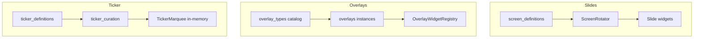

# waddle_display — design language

Human-facing guide for contributors extending the TV dashboard: slides, overlays, ticker behavior, and display-runtime safety. **Prerequisites, build, and env vars** are in [`README.md`](README.md). **Runtime modules, ports, and sequence diagrams** are in [`ARCHITECTURE.md`](ARCHITECTURE.md). **Enforcement** for agents and CI is in [`.cursor/rules/waddle-view-flutter.mdc`](../../.cursor/rules/waddle-view-flutter.mdc); step-by-step checklists stay in [`.cursor/skills/`](../../.cursor/skills/).

## Purpose

Flutter **always-on** dashboard (Linux TV primary; Windows desktop for dev). A single process runs the UI, background collection/curator loops, and embedded Shelf REST API. Operators configure content through **waddle_controller** and display REST; the dashboard reads SQLite (Drift) and filesystem blobs at runtime.

## Docs split

| Document | Use when you need |
|----------|-------------------|
| [`ARCHITECTURE.md`](ARCHITECTURE.md) | Module map, startup order, data collection, REST, mermaid flows |
| **This file** | How to add features consistently and avoid display-time footguns |
| [`README.md`](README.md) | Install, run, coverage commands, operator CLI |

## Core principles

- **Ports and adapters:** abstract boundaries (`IDataProvider`, `BlobStore`, `SecretStore`, `DashboardCurator`, repositories) with Drift/filesystem implementations; composition root in [`lib/main.dart`](lib/main.dart).
- **Drift as the hub:** screens, overlays, integrations, alerts, blob metadata, and config KV — schema and migrations live in [`packages/waddle_shared`](../../packages/waddle_shared).
- **No cleartext secrets in SQLite:** integration credentials are AES-GCM in `integration_secrets`; static provider keys come from the merged env map, not operator-pasted secrets in the DB.
- **Tests mirror `lib/`:** add or extend failing tests before new behavior; cap wall time via [`dart_test.yaml`](dart_test.yaml) (60s default).
- **Env catalog discipline:** new `WADDLE_DISPLAY_*` vars require the same change set in [`lib/config/display_env.dart`](lib/config/display_env.dart), [`.env.example`](.env.example), and a commented `# Environment=` line in [`deploy/linux-arm64/waddle-view.service`](../../deploy/linux-arm64/waddle-view.service).

## Resilience (display-time invariants)

These rules are non-negotiable on UI, preload, and rotator paths.

### Blob reads must not throw

[`FileSystemBlobStore.readBytes`](../../packages/waddle_shared/lib/blob/filesystem_blob_store.dart) propagates `FileSystemException` when metadata points at a missing file. Display code must **not** call `BlobStore.readBytes` directly.

Use [`readDisplayBlobBytes`](../../packages/waddle_shared/lib/blob/display_blob_read.dart) and map `DisplayBlobBytes` to absent UI (or `RssArticleImageLoad.blobReadFailed` when the slide should show a read-error state). Ingest/collection code may let I/O throw; **display** code may not.

### Fatal vs recoverable errors

Most uncaught errors restart the process via [`app_fatal_error_recovery.dart`](lib/bootstrap/app_fatal_error_recovery.dart). Harmless framework noise (layout overflow, `HardwareKeyboard` focus glitches) must use predicates beside `isRecoverableLayoutFlutterError` / `isRecoverableHardwareKeyboardError` and route through the recoverable-log path.

**Match on stack-frame library** (`package:flutter/src/...`) **and exception type** — not assertion message text (Flutter rewords these across releases).

## Content surfaces

Three layers operators see on the physical display:



| Surface | Persistence | Runtime |
|---------|-------------|---------|
| **Slides** | `screens` / layout JSON | [`ScreenRotator`](lib/display/screen_rotator.dart) dispatches by `type` |
| **Overlays** | `overlay_types` (catalog) + `overlays` (instances) | [`OverlayWidgetRegistry`](lib/extensions/overlay_widget_registry.dart); z-order for clocks/static before effects |
| **Ticker** | `ticker_definitions` | [`ticker_curation.dart`](lib/curator/ticker_curation.dart) → in-memory marquee; **no secrets** in marquee bodies ([`redactTickerBody`](lib/curator/ticker_curation.dart)) |

Curator **programs** assign which screens/overlays/ticker slots run; do not reimplement curator UI when adding overlay types — verify assignment when testing.

## Extension patterns

### New slide type (standalone)

Not for `kv_*` children inside `general_*` layouts — use [general-openai-kv-display](../../.cursor/skills/general-openai-kv-display/SKILL.md) instead.

1. Widget under `lib/display/screens/<feature>/`.
2. `case` in [`screen_rotator.dart`](lib/display/screen_rotator.dart).
3. Layout contract in `config_json_documentation.dart` (`kScreenLayoutWidgetTypes` / meta).
4. Optional `data_key` for curated provider content.
5. Tests under `test/display/…`.

Checklist: [add-display-screen](../../.cursor/skills/add-display-screen/SKILL.md). Example: [`WeatherSlideWidget`](lib/display/screens/weather/weather_slide_widget.dart).

### New built-in overlay

End-to-end: `waddle_shared` schema + `ensureOverlayTypes` → display widget + registry → controller [`OverlayConfigPanel`](../../apps/waddle_controller/src/components/config/OverlayConfigPanel.tsx).

| Category | Placement |
|----------|-----------|
| **Effects** | No viewport `x`/`y`/`scale` (celebration layers) |
| **Widgets** | Requires placement in schema + controller UI |

**Patterns:** schema-only (RJSF), normalize+parse, blob-backed (`readDisplayBlobBytes` in widget), fixed placement (clocks). Plugin overlays (`plugin_template_overlay`, `plugin_web_overlay`) use the plugin SDK — separate task.

Checklist: [add-display-overlay](../../.cursor/skills/add-display-overlay/SKILL.md).

### OpenAI + KV dashboards

1. **`general_openai` collector** (`waddle_integrations`) writes KV keys `prompt.{id}.latest` / `.history.*`.
2. **`general_*` screens** store `slots[]` in `config_json`; runtime flattens via `synthesizeLayoutJson` into [`GeneralLayoutSlideWidget`](lib/display/screens/general_layout/general_layout_slide_widget.dart).
3. **`kv_*` widgets** read integration KV via [`integration_kv_read.dart`](../../packages/waddle_shared/lib/integrations/integration_kv_read.dart).

Align prompt JSON with `kv_value_data_types` (list, table, chart, gauge, graph, image, shape). Set `responseFormat: json_object` when widgets need structured JSON.

Checklist and widget matrix: [general-openai-kv-display](../../.cursor/skills/general-openai-kv-display/SKILL.md).

### New ticker marquee type

1. Branch in [`ticker_curation.dart`](lib/curator/ticker_curation.dart) (`itemsForDef` / `expand…`).
2. Idempotent `ticker_definitions` seed ([`ticker_definitions_seed.dart`](lib/seed/tables/ticker_definitions_seed.dart) or `initial_seed.dart` — single source of truth).
3. Tests under `test/curator/`.

Checklist: [add-ticker-marquee-type](../../.cursor/skills/add-ticker-marquee-type/SKILL.md).

## Schema sources

Operator and controller UIs load shapes from the display meta bundle:

| Layer | Dart catalog | REST (`GET /v1/meta/config-schemas`) |
|-------|----------------|--------------------------------------|
| Integration config | `kProviderConfigJsonMeta` | `integration_types` |
| Screen layout | `screenConfigJsonDocForType` | `screen_types` |
| Overlay config | `displayOverlayConfigJsonDocForType` → DB `overlay_types` | `overlay_types` |
| KV widget config | `kKvWidgetConfigJsonMeta` | `kv_widget_types` |
| KV value shape | `kKvValueDataTypeMeta` | `kv_value_data_types` |

Drift **migrations** for table shape changes: [`packages/waddle_shared/lib/persistence/`](../../packages/waddle_shared/lib/persistence/) + tests in `packages/waddle_shared/test/`.

## Anti-patterns

- Calling `BlobStore.readBytes` on slide UI, preload, or rotator paths.
- Adding `kv_*` as a standalone screen type instead of a slot inside `general_*`.
- Exposing built-in overlay types by unioning code constants at API read time without `overlay_types` rows.
- Reimplementing curator assignment UI when adding overlay types.
- Plugin overlay work mixed into built-in overlay checklist.
- Drive-by refactors unrelated to the task.
- Matching recoverable-error predicates on Flutter assertion **message text**.

## Extension index

| Task | Skill |
|------|--------|
| New slide widget type | [add-display-screen](../../.cursor/skills/add-display-screen/SKILL.md) |
| New built-in overlay | [add-display-overlay](../../.cursor/skills/add-display-overlay/SKILL.md) |
| OpenAI prompts + KV widgets | [general-openai-kv-display](../../.cursor/skills/general-openai-kv-display/SKILL.md) |
| Ticker marquee type | [add-ticker-marquee-type](../../.cursor/skills/add-ticker-marquee-type/SKILL.md) |
| New data provider / collector | [add-provider](../../.cursor/skills/add-provider/SKILL.md) |
| New REST route | [add-rest-route](../../.cursor/skills/add-rest-route/SKILL.md) |
| Controller config forms (operator) | [schema-config-form](../../.cursor/skills/schema-config-form/SKILL.md) |

## Quality bar

From `apps/waddle_display`:

```bash
flutter analyze          # zero issues (warnings fail CI)
flutter test --coverage
dart run tool/coverage_check.dart --min=85 --target=90
```

Shared Drift tests: `flutter test` under `packages/waddle_shared` (not plain `dart test` where `flutter_test` is imported). After schema edits: `dart run build_runner build --delete-conflicting-outputs` in `waddle_shared`.
