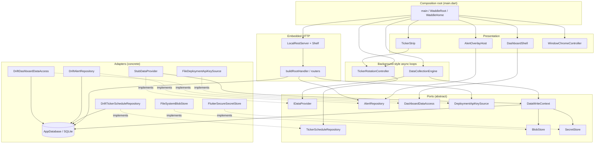
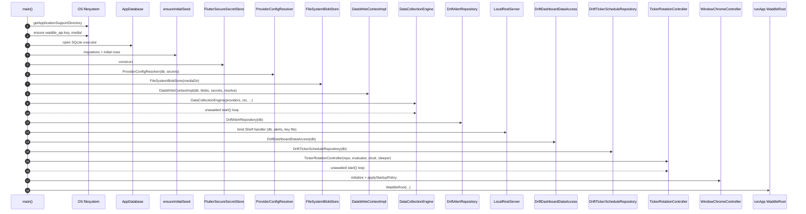
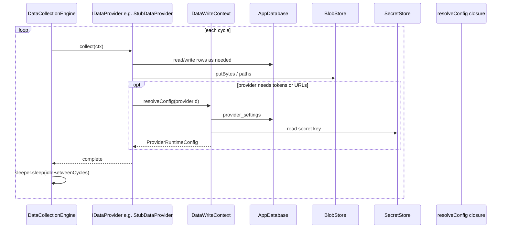
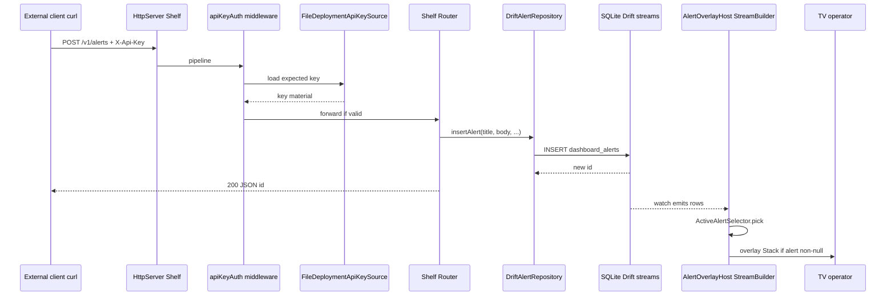
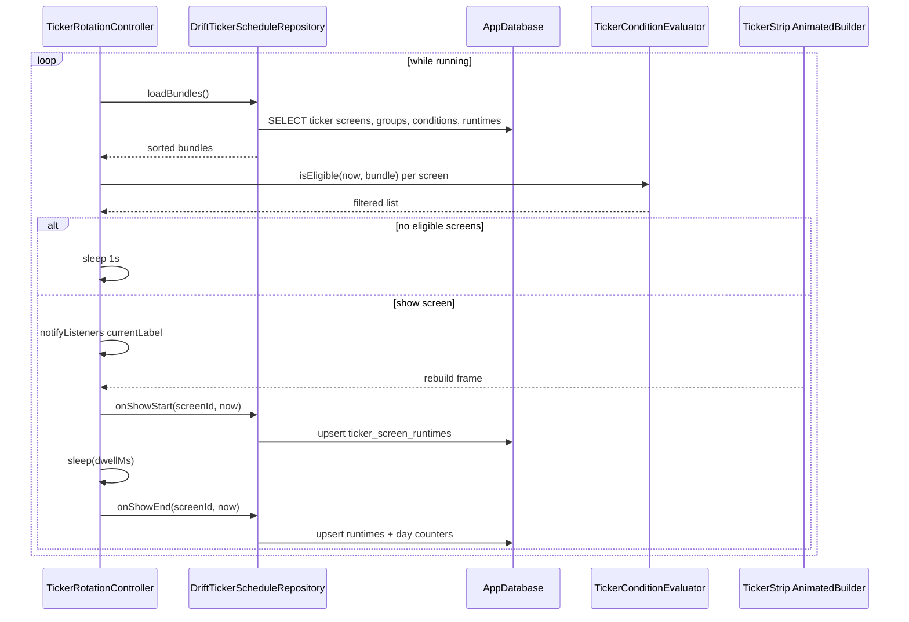

# waddle_view architecture

This document describes how the TV dashboard is structured at runtime and how major subsystems interact. The **composition root** is [`lib/main.dart`](lib/main.dart); feature code is grouped by responsibility under [`lib/`](lib/).

## Design goals

- **Single process**: Flutter UI, background async loops, and the embedded HTTP server share one isolate unless you add isolates later.
- **Ports and adapters**: abstract boundaries (`IDataProvider`, `DataWriteContext`, `AlertRepository`, `TickerScheduleRepository`, `BlobStore`, `SecretStore`, `WindowChromeController`) with Drift/filesystem/Linux implementations.
- **No secrets in SQLite**: provider tokens and similar values go through [`SecretStore`](lib/secrets/secret_store.dart); SQLite holds non-secret configuration and operational data.
- **Drift as the hub**: ticker schedule, dashboard key–value fields, alerts, blob metadata, and provider settings all read/write through [`AppDatabase`](lib/persistence/database.dart).

## Module map

High-level dependency direction (arrows read as “uses” or “writes through”):

## Composition and lifecycle

At startup, `main()` wires concrete implementations, starts long-running `Future`s with `unawaited`, then calls `runApp`. On `WaddleHome` dispose, the data engine and ticker stop, the Shelf server closes, and the database closes.

## Sequence: application startup

From [`lib/main.dart`](lib/main.dart): filesystem prep → database + seed → secrets and data context → collection engine → alerts + REST → dashboard access + ticker → window policy → `runApp`.

## Sequence: data collection cycle

[`DataCollectionEngine`](lib/data/engine/data_collection_engine.dart) walks the configured [`IDataProvider`](lib/data/data_provider.dart) list in order, awaits each `collect`, then sleeps `idleBetweenCycles` (shorter in debug builds). Providers must not run overlapping collects; the engine enforces one in flight.

The stub provider demonstrates the path: it upserts [`dashboard_kv`](lib/data/stub_data_provider.dart) (feeds the header title stream) and registers a small blob plus [`blob_metadata`](lib/data/stub_data_provider.dart).

## Sequence: REST alert to on-screen overlay

Shelf runs the [`buildRootHandler`](lib/api/local_rest_server.dart) pipeline: public `GET /v1/health`, then API-key middleware and the protected router. [`DriftAlertRepository.insertAlert`](lib/alerts/drift_alert_repository.dart) inserts a row; Drift’s `watch()` drives [`AlertOverlayHost`](lib/alerts/alert_overlay_host.dart), which uses [`ActiveAlertSelector`](lib/alerts/active_alert_selector.dart) to pick the visible alert by priority, recency, and expiry.

`GET` routes for providers, ticker screens, and alerts follow the same auth middleware and read directly from `AppDatabase` via generated Drift APIs in [`local_rest_server.dart`](lib/api/local_rest_server.dart).

## Sequence: ticker rotation and strip

[`TickerRotationController`](lib/ticker/ticker_rotation_controller.dart) loads eligible screens from the repository, applies [`TickerConditionEvaluator`](lib/ticker/ticker_condition_evaluator.dart), updates `currentLabel`, calls `notifyListeners()`, dwells for `dwellMs`, then persists show telemetry via `onShowStart` / `onShowEnd`. [`TickerStrip`](lib/ticker/ticker_strip.dart) is an `AnimatedBuilder` on that controller.

## Related reading

- [`README.md`](README.md) — run modes, build output, REST bind address, Pi pointers.
- [`../../docs/pi/api.md`](../../docs/pi/api.md) — HTTP paths and headers.
- [`../../AGENTS.md`](../../AGENTS.md) — repo conventions for contributors.
